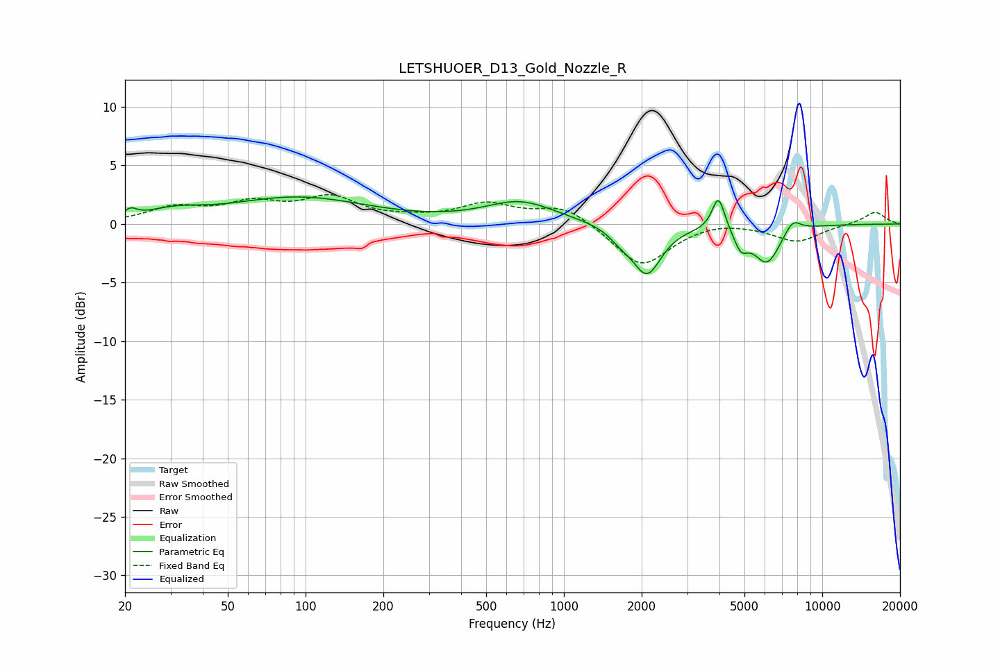

# LETSHUOER_D13_Gold_Nozzle_R
See [usage instructions](https://github.com/jaakkopasanen/AutoEq#usage) for more options and info.

### Parametric EQs
Apply preamp of -2.4 dB when using parametric equalizer.

|   # | Type    |   Fc (Hz) |    Q |   Gain (dB) |
|-----|---------|-----------|------|-------------|
|   1 | Peaking |        21 | 5.99 |         0.6 |
|   2 | Peaking |        31 | 1.32 |         0.8 |
|   3 | Peaking |        94 | 0.53 |         2.2 |
|   4 | Peaking |       678 | 1.04 |         1.9 |
|   5 | Peaking |      1661 | 3.14 |        -0.8 |
|   6 | Peaking |      2097 | 2.53 |        -4.2 |
|   7 | Peaking |      3965 | 5.71 |         3   |
|   8 | Peaking |      4843 | 5.14 |        -1.6 |
|   9 | Peaking |      6113 | 2.59 |        -3.3 |
|  10 | Peaking |      7673 | 4.12 |         1.2 |

### Fixed Band EQs
When using fixed band (also called graphic) equalizer, apply preamp of **-2.6 dB** (if available) and set gains manually with these parameters.

|   # | Type    |   Fc (Hz) |    Q |   Gain (dB) |
|-----|---------|-----------|------|-------------|
|   1 | Peaking |        31 | 1.41 |         1.3 |
|   2 | Peaking |        62 | 1.41 |         1.5 |
|   3 | Peaking |       125 | 1.41 |         2.1 |
|   4 | Peaking |       250 | 1.41 |         0.3 |
|   5 | Peaking |       500 | 1.41 |         1.6 |
|   6 | Peaking |      1000 | 1.41 |         1.5 |
|   7 | Peaking |      2000 | 1.41 |        -3.7 |
|   8 | Peaking |      4000 | 1.41 |         0.4 |
|   9 | Peaking |      8000 | 1.41 |        -1.5 |
|  10 | Peaking |     16000 | 1.41 |         1.1 |

### Graphs

