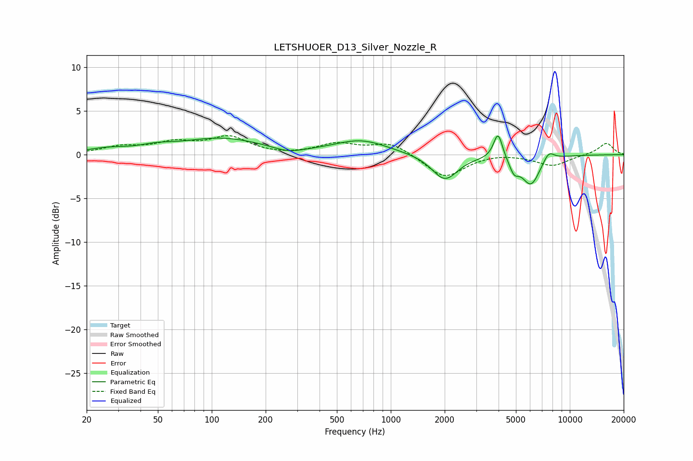

# LETSHUOER_D13_Silver_Nozzle_R
See [usage instructions](https://github.com/jaakkopasanen/AutoEq#usage) for more options and info.

### Parametric EQs
Apply preamp of -2.3 dB when using parametric equalizer.

|   # | Type    |   Fc (Hz) |    Q |   Gain (dB) |
|-----|---------|-----------|------|-------------|
|   1 | Peaking |        26 | 1.27 |         0.5 |
|   2 | Peaking |        49 | 1.51 |         0.5 |
|   3 | Peaking |       113 | 0.61 |         1.8 |
|   4 | Peaking |       268 | 1.71 |        -0.6 |
|   5 | Peaking |       682 | 0.95 |         1.6 |
|   6 | Peaking |      2004 | 1.98 |        -2.9 |
|   7 | Peaking |      3972 | 5.64 |         3   |
|   8 | Peaking |      4879 | 5.39 |        -1.4 |
|   9 | Peaking |      6063 | 2.66 |        -3.4 |
|  10 | Peaking |      7616 | 4.23 |         1.2 |

### Fixed Band EQs
When using fixed band (also called graphic) equalizer, apply preamp of **-2.3 dB** (if available) and set gains manually with these parameters.

|   # | Type    |   Fc (Hz) |    Q |   Gain (dB) |
|-----|---------|-----------|------|-------------|
|   1 | Peaking |        31 | 1.41 |         0.8 |
|   2 | Peaking |        62 | 1.41 |         1.2 |
|   3 | Peaking |       125 | 1.41 |         1.9 |
|   4 | Peaking |       250 | 1.41 |        -0.1 |
|   5 | Peaking |       500 | 1.41 |         1.2 |
|   6 | Peaking |      1000 | 1.41 |         1.4 |
|   7 | Peaking |      2000 | 1.41 |        -2.7 |
|   8 | Peaking |      4000 | 1.41 |         0.2 |
|   9 | Peaking |      8000 | 1.41 |        -1.3 |
|  10 | Peaking |     16000 | 1.41 |         1.4 |

### Graphs

