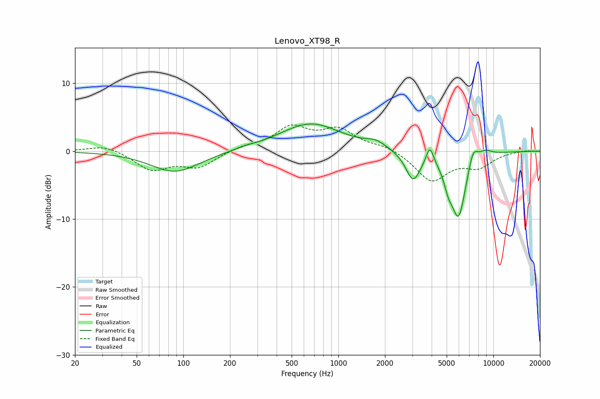

# Lenovo_XT98_R
See [usage instructions](https://github.com/jaakkopasanen/AutoEq#usage) for more options and info.

### Parametric EQs
Apply preamp of -4.1 dB when using parametric equalizer.

|   # | Type    |   Fc (Hz) |    Q |   Gain (dB) |
|-----|---------|-----------|------|-------------|
|   1 | Peaking |        88 | 0.9  |        -3.1 |
|   2 | Peaking |       252 | 2.35 |         0.2 |
|   3 | Peaking |       663 | 0.72 |         4.1 |
|   4 | Peaking |      1742 | 2.19 |         0.9 |
|   5 | Peaking |      3035 | 3    |        -4.2 |
|   6 | Peaking |      3895 | 6    |         2.6 |
|   7 | Peaking |      5122 | 5.17 |        -2.1 |
|   8 | Peaking |      5962 | 2.75 |        -9.6 |
|   9 | Peaking |      7397 | 4.3  |         2.7 |
|  10 | Peaking |      8866 | 2.96 |         0.9 |

### Fixed Band EQs
When using fixed band (also called graphic) equalizer, apply preamp of **-4.0 dB** (if available) and set gains manually with these parameters.

|   # | Type    |   Fc (Hz) |    Q |   Gain (dB) |
|-----|---------|-----------|------|-------------|
|   1 | Peaking |        31 | 1.41 |         1   |
|   2 | Peaking |        62 | 1.41 |        -2.7 |
|   3 | Peaking |       125 | 1.41 |        -2.2 |
|   4 | Peaking |       250 | 1.41 |         0.6 |
|   5 | Peaking |       500 | 1.41 |         3.3 |
|   6 | Peaking |      1000 | 1.41 |         2.9 |
|   7 | Peaking |      2000 | 1.41 |         0.8 |
|   8 | Peaking |      4000 | 1.41 |        -4.3 |
|   9 | Peaking |      8000 | 1.41 |        -2.1 |
|  10 | Peaking |     16000 | 1.41 |         0.1 |

### Graphs

