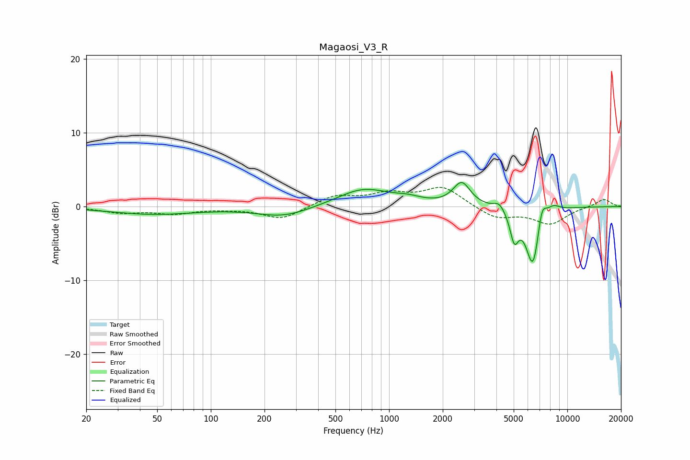

# Magaosi_V3_R
See [usage instructions](https://github.com/jaakkopasanen/AutoEq#usage) for more options and info.

### Parametric EQs
Apply preamp of -3.4 dB when using parametric equalizer.

|   # | Type    |   Fc (Hz) |    Q |   Gain (dB) |
|-----|---------|-----------|------|-------------|
|   1 | Peaking |        48 | 0.58 |        -1   |
|   2 | Peaking |       256 | 0.95 |        -1.4 |
|   3 | Peaking |       719 | 0.96 |         2.4 |
|   4 | Peaking |      1280 | 1.83 |         0.6 |
|   5 | Peaking |      2554 | 2.94 |         3.1 |
|   6 | Peaking |      4150 | 4.57 |         1.1 |
|   7 | Peaking |      5041 | 5.89 |        -3.7 |
|   8 | Peaking |      6426 | 3.36 |        -8.6 |
|   9 | Peaking |      7180 | 5.18 |         3.5 |
|  10 | Peaking |      8307 | 3.4  |         1   |

### Fixed Band EQs
When using fixed band (also called graphic) equalizer, apply preamp of **-2.7 dB** (if available) and set gains manually with these parameters.

|   # | Type    |   Fc (Hz) |    Q |   Gain (dB) |
|-----|---------|-----------|------|-------------|
|   1 | Peaking |        31 | 1.41 |        -0.8 |
|   2 | Peaking |        62 | 1.41 |        -0.9 |
|   3 | Peaking |       125 | 1.41 |        -0.2 |
|   4 | Peaking |       250 | 1.41 |        -1.7 |
|   5 | Peaking |       500 | 1.41 |         1.4 |
|   6 | Peaking |      1000 | 1.41 |         1.5 |
|   7 | Peaking |      2000 | 1.41 |         2.6 |
|   8 | Peaking |      4000 | 1.41 |        -1.6 |
|   9 | Peaking |      8000 | 1.41 |        -2.3 |
|  10 | Peaking |     16000 | 1.41 |         1.1 |

### Graphs

