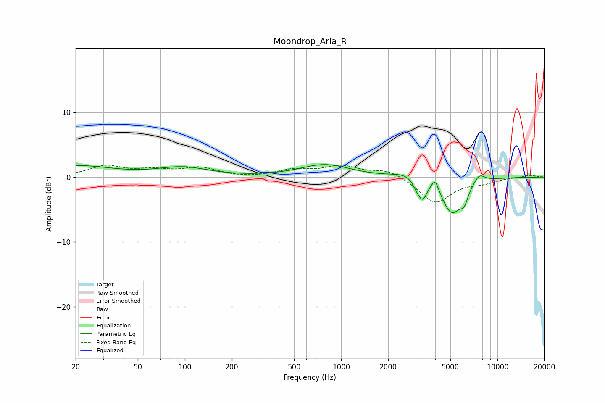

# Moondrop_Aria_R
See [usage instructions](https://github.com/jaakkopasanen/AutoEq#usage) for more options and info.

### Parametric EQs
Apply preamp of -2.0 dB when using parametric equalizer.

|   # | Type    |   Fc (Hz) |    Q |   Gain (dB) |
|-----|---------|-----------|------|-------------|
|   1 | Peaking |        20 | 0.62 |         1.7 |
|   2 | Peaking |        97 | 0.89 |         1.4 |
|   3 | Peaking |       789 | 0.9  |         1.9 |
|   4 | Peaking |      2585 | 1.75 |         0.7 |
|   5 | Peaking |      3038 | 6    |        -1   |
|   6 | Peaking |      3320 | 5.22 |        -2.7 |
|   7 | Peaking |      3993 | 5.99 |         1.9 |
|   8 | Peaking |      5100 | 2.12 |        -5.5 |
|   9 | Peaking |      6126 | 5.64 |        -1.9 |
|  10 | Peaking |      7638 | 3.82 |         1.4 |

### Fixed Band EQs
When using fixed band (also called graphic) equalizer, apply preamp of **-1.9 dB** (if available) and set gains manually with these parameters.

|   # | Type    |   Fc (Hz) |    Q |   Gain (dB) |
|-----|---------|-----------|------|-------------|
|   1 | Peaking |        31 | 1.41 |         1.6 |
|   2 | Peaking |        62 | 1.41 |         0.9 |
|   3 | Peaking |       125 | 1.41 |         1.3 |
|   4 | Peaking |       250 | 1.41 |        -0.1 |
|   5 | Peaking |       500 | 1.41 |         1   |
|   6 | Peaking |      1000 | 1.41 |         1.6 |
|   7 | Peaking |      2000 | 1.41 |         1.2 |
|   8 | Peaking |      4000 | 1.41 |        -4   |
|   9 | Peaking |      8000 | 1.41 |        -0.7 |
|  10 | Peaking |     16000 | 1.41 |         0.3 |

### Graphs

