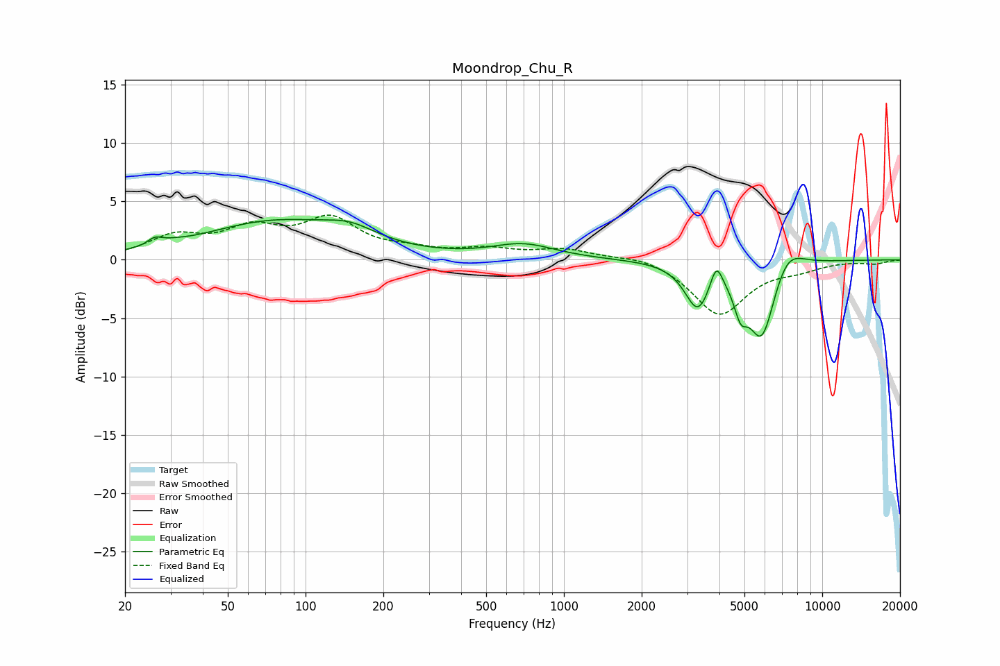

# Moondrop_Chu_R
See [usage instructions](https://github.com/jaakkopasanen/AutoEq#usage) for more options and info.

### Parametric EQs
Apply preamp of -3.6 dB when using parametric equalizer.

|   # | Type    |   Fc (Hz) |    Q |   Gain (dB) |
|-----|---------|-----------|------|-------------|
|   1 | Peaking |        26 | 4.9  |         0.6 |
|   2 | Peaking |        31 | 2.87 |         0.2 |
|   3 | Peaking |        77 | 0.51 |         3.2 |
|   4 | Peaking |       149 | 1.43 |         1.1 |
|   5 | Peaking |       696 | 1.14 |         1.2 |
|   6 | Peaking |      3297 | 2.87 |        -3.9 |
|   7 | Peaking |      3892 | 5.93 |         2.2 |
|   8 | Peaking |      4831 | 5.44 |        -2.4 |
|   9 | Peaking |      5834 | 2.54 |        -6.9 |
|  10 | Peaking |      7270 | 2.15 |         2.2 |

### Fixed Band EQs
When using fixed band (also called graphic) equalizer, apply preamp of **-3.9 dB** (if available) and set gains manually with these parameters.

|   # | Type    |   Fc (Hz) |    Q |   Gain (dB) |
|-----|---------|-----------|------|-------------|
|   1 | Peaking |        31 | 1.41 |         1.8 |
|   2 | Peaking |        62 | 1.41 |         2.3 |
|   3 | Peaking |       125 | 1.41 |         3.2 |
|   4 | Peaking |       250 | 1.41 |         0.6 |
|   5 | Peaking |       500 | 1.41 |         0.8 |
|   6 | Peaking |      1000 | 1.41 |         0.8 |
|   7 | Peaking |      2000 | 1.41 |         0.5 |
|   8 | Peaking |      4000 | 1.41 |        -4.7 |
|   9 | Peaking |      8000 | 1.41 |        -0.6 |
|  10 | Peaking |     16000 | 1.41 |        -0.3 |

### Graphs

