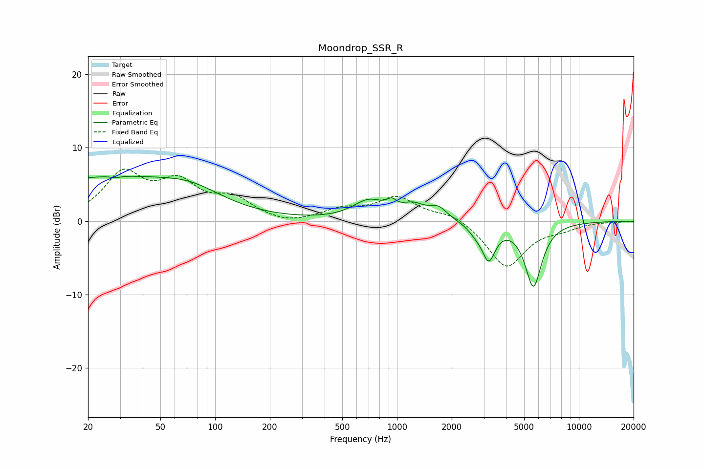

# Moondrop_SSR_R
See [usage instructions](https://github.com/jaakkopasanen/AutoEq#usage) for more options and info.

### Parametric EQs
Apply preamp of -6.2 dB when using parametric equalizer.

|   # | Type    |   Fc (Hz) |    Q |   Gain (dB) |
|-----|---------|-----------|------|-------------|
|   1 | Peaking |        24 | 0.31 |         5.8 |
|   2 | Peaking |        28 | 5.61 |        -0.2 |
|   3 | Peaking |        74 | 0.83 |         2   |
|   4 | Peaking |       701 | 1.61 |         2.5 |
|   5 | Peaking |       935 | 5.41 |         1   |
|   6 | Peaking |      1227 | 2.19 |         1.7 |
|   7 | Peaking |      1687 | 2.87 |         1.6 |
|   8 | Peaking |      2709 | 3.41 |        -0.9 |
|   9 | Peaking |      3196 | 3.89 |        -4.6 |
|  10 | Peaking |      5624 | 3    |        -8.7 |

### Fixed Band EQs
When using fixed band (also called graphic) equalizer, apply preamp of **-7.2 dB** (if available) and set gains manually with these parameters.

|   # | Type    |   Fc (Hz) |    Q |   Gain (dB) |
|-----|---------|-----------|------|-------------|
|   1 | Peaking |        31 | 1.41 |         6.1 |
|   2 | Peaking |        62 | 1.41 |         4.6 |
|   3 | Peaking |       125 | 1.41 |         2.7 |
|   4 | Peaking |       250 | 1.41 |        -0.6 |
|   5 | Peaking |       500 | 1.41 |         1.4 |
|   6 | Peaking |      1000 | 1.41 |         3.1 |
|   7 | Peaking |      2000 | 1.41 |         1.2 |
|   8 | Peaking |      4000 | 1.41 |        -6.3 |
|   9 | Peaking |      8000 | 1.41 |        -0.8 |
|  10 | Peaking |     16000 | 1.41 |        -0.1 |

### Graphs

