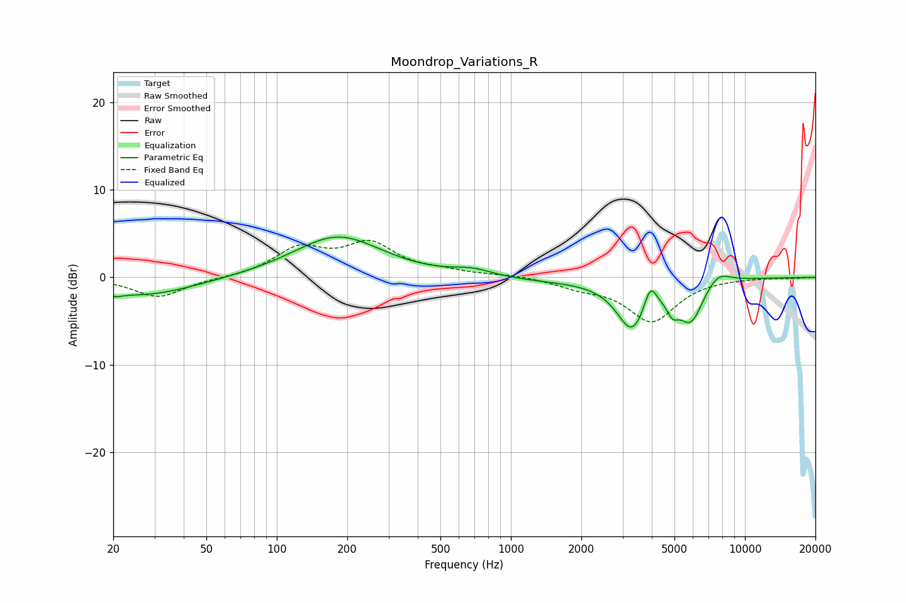

# Moondrop_Variations_R
See [usage instructions](https://github.com/jaakkopasanen/AutoEq#usage) for more options and info.

### Parametric EQs
Apply preamp of -4.7 dB when using parametric equalizer.

|   # | Type    |   Fc (Hz) |    Q |   Gain (dB) |
|-----|---------|-----------|------|-------------|
|   1 | Peaking |        20 | 5.23 |        -0.4 |
|   2 | Peaking |        27 | 0.63 |        -2.1 |
|   3 | Peaking |       182 | 0.76 |         4.7 |
|   4 | Peaking |       688 | 1.6  |         0.8 |
|   5 | Peaking |      1437 | 0.39 |        -0.4 |
|   6 | Peaking |      3300 | 2.19 |        -5.6 |
|   7 | Peaking |      3938 | 5.26 |         2.8 |
|   8 | Peaking |      4902 | 5.52 |        -1.7 |
|   9 | Peaking |      5867 | 2.57 |        -4.6 |
|  10 | Peaking |      7652 | 2.51 |         1.5 |

### Fixed Band EQs
When using fixed band (also called graphic) equalizer, apply preamp of **-4.3 dB** (if available) and set gains manually with these parameters.

|   # | Type    |   Fc (Hz) |    Q |   Gain (dB) |
|-----|---------|-----------|------|-------------|
|   1 | Peaking |        31 | 1.41 |        -2.3 |
|   2 | Peaking |        62 | 1.41 |        -0.1 |
|   3 | Peaking |       125 | 1.41 |         3.1 |
|   4 | Peaking |       250 | 1.41 |         3.6 |
|   5 | Peaking |       500 | 1.41 |         0.5 |
|   6 | Peaking |      1000 | 1.41 |         0.3 |
|   7 | Peaking |      2000 | 1.41 |        -0.9 |
|   8 | Peaking |      4000 | 1.41 |        -4.9 |
|   9 | Peaking |      8000 | 1.41 |        -0   |
|  10 | Peaking |     16000 | 1.41 |        -0.1 |

### Graphs

