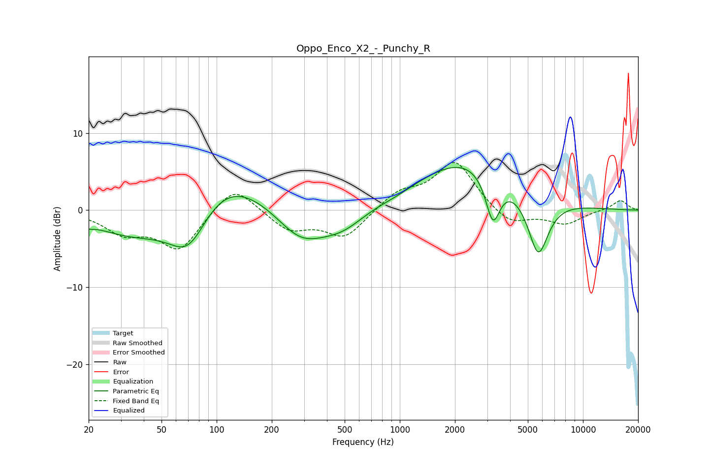

# Oppo_Enco_X2_-_Punchy_R
See [usage instructions](https://github.com/jaakkopasanen/AutoEq#usage) for more options and info.

### Parametric EQs
Apply preamp of -5.6 dB when using parametric equalizer.

|   # | Type    |   Fc (Hz) |    Q |   Gain (dB) |
|-----|---------|-----------|------|-------------|
|   1 | Peaking |        20 | 5.45 |        -0.4 |
|   2 | Peaking |        36 | 0.62 |        -3.8 |
|   3 | Peaking |        70 | 1.14 |        -8.1 |
|   4 | Peaking |        97 | 0.58 |         7.1 |
|   5 | Peaking |       289 | 1    |        -4.5 |
|   6 | Peaking |       487 | 1.14 |        -2.3 |
|   7 | Peaking |       958 | 1.61 |        -0.3 |
|   8 | Peaking |      2347 | 0.52 |         6.7 |
|   9 | Peaking |      3222 | 3.5  |        -6.2 |
|  10 | Peaking |      5693 | 2.38 |        -8.1 |

### Fixed Band EQs
When using fixed band (also called graphic) equalizer, apply preamp of **-6.3 dB** (if available) and set gains manually with these parameters.

|   # | Type    |   Fc (Hz) |    Q |   Gain (dB) |
|-----|---------|-----------|------|-------------|
|   1 | Peaking |        31 | 1.41 |        -2.7 |
|   2 | Peaking |        62 | 1.41 |        -5   |
|   3 | Peaking |       125 | 1.41 |         3.6 |
|   4 | Peaking |       250 | 1.41 |        -2.5 |
|   5 | Peaking |       500 | 1.41 |        -3.5 |
|   6 | Peaking |      1000 | 1.41 |         2.2 |
|   7 | Peaking |      2000 | 1.41 |         6.3 |
|   8 | Peaking |      4000 | 1.41 |        -2.1 |
|   9 | Peaking |      8000 | 1.41 |        -1.8 |
|  10 | Peaking |     16000 | 1.41 |         1.3 |

### Graphs

