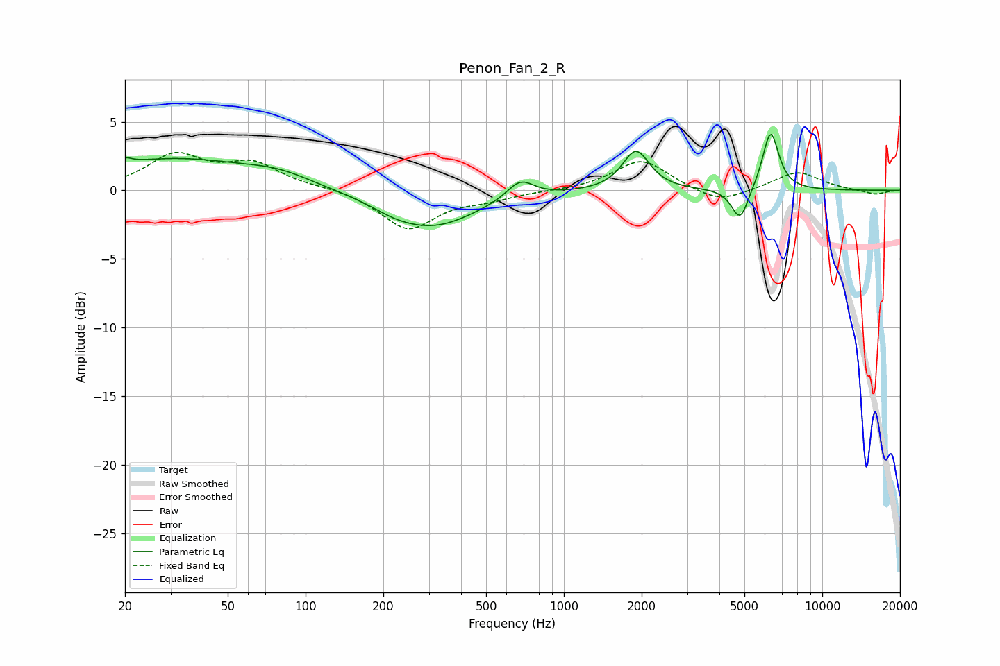

# Penon_Fan_2_R
See [usage instructions](https://github.com/jaakkopasanen/AutoEq#usage) for more options and info.

### Parametric EQs
Apply preamp of -4.2 dB when using parametric equalizer.

|   # | Type    |   Fc (Hz) |    Q |   Gain (dB) |
|-----|---------|-----------|------|-------------|
|   1 | Peaking |        20 | 5.98 |        -1.9 |
|   2 | Peaking |        20 | 5.98 |         2.3 |
|   3 | Peaking |        31 | 0.45 |         2.3 |
|   4 | Peaking |        79 | 1.12 |         0.7 |
|   5 | Peaking |       220 | 1.75 |        -0.3 |
|   6 | Peaking |       308 | 0.81 |        -2.6 |
|   7 | Peaking |       678 | 2.71 |         1.4 |
|   8 | Peaking |      1902 | 2.73 |         2.9 |
|   9 | Peaking |      4809 | 4.29 |        -2.4 |
|  10 | Peaking |      6313 | 4.38 |         4.4 |

### Fixed Band EQs
When using fixed band (also called graphic) equalizer, apply preamp of **-2.9 dB** (if available) and set gains manually with these parameters.

|   # | Type    |   Fc (Hz) |    Q |   Gain (dB) |
|-----|---------|-----------|------|-------------|
|   1 | Peaking |        31 | 1.41 |         2.4 |
|   2 | Peaking |        62 | 1.41 |         1.8 |
|   3 | Peaking |       125 | 1.41 |         0.2 |
|   4 | Peaking |       250 | 1.41 |        -2.8 |
|   5 | Peaking |       500 | 1.41 |        -0.5 |
|   6 | Peaking |      1000 | 1.41 |        -0   |
|   7 | Peaking |      2000 | 1.41 |         2.3 |
|   8 | Peaking |      4000 | 1.41 |        -1   |
|   9 | Peaking |      8000 | 1.41 |         1.4 |
|  10 | Peaking |     16000 | 1.41 |        -0.3 |

### Graphs

