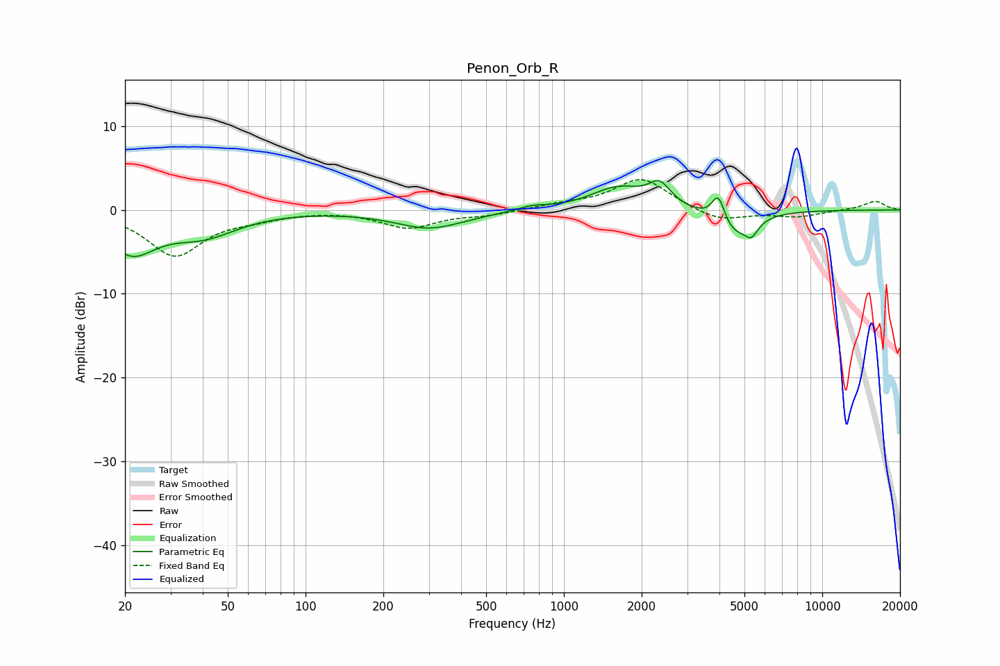

# Penon_Orb_R
See [usage instructions](https://github.com/jaakkopasanen/AutoEq#usage) for more options and info.

### Parametric EQs
Apply preamp of -3.6 dB when using parametric equalizer.

|   # | Type    |   Fc (Hz) |    Q |   Gain (dB) |
|-----|---------|-----------|------|-------------|
|   1 | Peaking |        21 | 1.49 |        -4.7 |
|   2 | Peaking |        40 | 1.07 |        -2.7 |
|   3 | Peaking |       290 | 5.75 |        -0   |
|   4 | Peaking |       304 | 1.02 |        -2.1 |
|   5 | Peaking |       752 | 2.52 |         0.5 |
|   6 | Peaking |      1625 | 1.34 |         2.7 |
|   7 | Peaking |      2348 | 3.39 |         2.5 |
|   8 | Peaking |      3961 | 5.57 |         3.5 |
|   9 | Peaking |      4521 | 1.92 |        -3.1 |
|  10 | Peaking |      5320 | 5.51 |        -1.6 |

### Fixed Band EQs
When using fixed band (also called graphic) equalizer, apply preamp of **-3.7 dB** (if available) and set gains manually with these parameters.

|   # | Type    |   Fc (Hz) |    Q |   Gain (dB) |
|-----|---------|-----------|------|-------------|
|   1 | Peaking |        31 | 1.41 |        -5.4 |
|   2 | Peaking |        62 | 1.41 |        -0.7 |
|   3 | Peaking |       125 | 1.41 |         0.1 |
|   4 | Peaking |       250 | 1.41 |        -2.1 |
|   5 | Peaking |       500 | 1.41 |        -0.5 |
|   6 | Peaking |      1000 | 1.41 |         0.5 |
|   7 | Peaking |      2000 | 1.41 |         3.8 |
|   8 | Peaking |      4000 | 1.41 |        -1.4 |
|   9 | Peaking |      8000 | 1.41 |        -0.8 |
|  10 | Peaking |     16000 | 1.41 |         1.1 |

### Graphs

