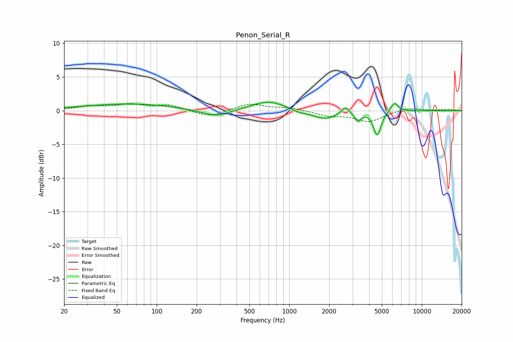

# Penon_Serial_R
See [usage instructions](https://github.com/jaakkopasanen/AutoEq#usage) for more options and info.

### Parametric EQs
Apply preamp of -1.3 dB when using parametric equalizer.

|   # | Type    |   Fc (Hz) |    Q |   Gain (dB) |
|-----|---------|-----------|------|-------------|
|   1 | Peaking |        62 | 0.41 |         1   |
|   2 | Peaking |       278 | 1.27 |        -1.1 |
|   3 | Peaking |       668 | 0.89 |         0.3 |
|   4 | Peaking |       711 | 1.1  |         1.2 |
|   5 | Peaking |      1191 | 1.96 |        -0.5 |
|   6 | Peaking |      1860 | 1.69 |        -1.2 |
|   7 | Peaking |      2657 | 5.35 |         1   |
|   8 | Peaking |      3291 | 6    |        -1.3 |
|   9 | Peaking |      4615 | 5.04 |        -3.6 |
|  10 | Peaking |      6210 | 5    |         1.4 |

### Fixed Band EQs
When using fixed band (also called graphic) equalizer, apply preamp of **-1.1 dB** (if available) and set gains manually with these parameters.

|   # | Type    |   Fc (Hz) |    Q |   Gain (dB) |
|-----|---------|-----------|------|-------------|
|   1 | Peaking |        31 | 1.41 |         0.6 |
|   2 | Peaking |        62 | 1.41 |         0.8 |
|   3 | Peaking |       125 | 1.41 |         0.8 |
|   4 | Peaking |       250 | 1.41 |        -1   |
|   5 | Peaking |       500 | 1.41 |         1.1 |
|   6 | Peaking |      1000 | 1.41 |         0.4 |
|   7 | Peaking |      2000 | 1.41 |        -0.7 |
|   8 | Peaking |      4000 | 1.41 |        -1.6 |
|   9 | Peaking |      8000 | 1.41 |         0.5 |
|  10 | Peaking |     16000 | 1.41 |         0.2 |

### Graphs

