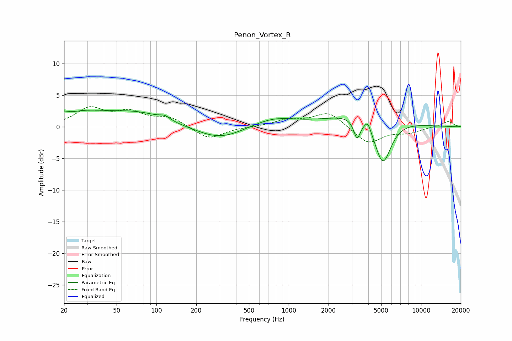

# Penon_Vortex_R
See [usage instructions](https://github.com/jaakkopasanen/AutoEq#usage) for more options and info.

### Parametric EQs
Apply preamp of -2.7 dB when using parametric equalizer.

|   # | Type    |   Fc (Hz) |    Q |   Gain (dB) |
|-----|---------|-----------|------|-------------|
|   1 | Peaking |        20 | 0.4  |         2.5 |
|   2 | Peaking |        23 | 2.87 |        -0.4 |
|   3 | Peaking |        77 | 0.7  |         1.6 |
|   4 | Peaking |       116 | 3.75 |         0.6 |
|   5 | Peaking |       302 | 0.81 |        -2   |
|   6 | Peaking |       764 | 0.87 |         1.4 |
|   7 | Peaking |      3284 | 5.65 |        -3   |
|   8 | Peaking |      3803 | 0.57 |         2.5 |
|   9 | Peaking |      3960 | 6    |         1.4 |
|  10 | Peaking |      5145 | 2.12 |        -7.6 |

### Fixed Band EQs
When using fixed band (also called graphic) equalizer, apply preamp of **-3.3 dB** (if available) and set gains manually with these parameters.

|   # | Type    |   Fc (Hz) |    Q |   Gain (dB) |
|-----|---------|-----------|------|-------------|
|   1 | Peaking |        31 | 1.41 |         2.8 |
|   2 | Peaking |        62 | 1.41 |         2.1 |
|   3 | Peaking |       125 | 1.41 |         1.4 |
|   4 | Peaking |       250 | 1.41 |        -2   |
|   5 | Peaking |       500 | 1.41 |         0   |
|   6 | Peaking |      1000 | 1.41 |         1   |
|   7 | Peaking |      2000 | 1.41 |         2.3 |
|   8 | Peaking |      4000 | 1.41 |        -2.7 |
|   9 | Peaking |      8000 | 1.41 |        -0.8 |
|  10 | Peaking |     16000 | 1.41 |         0.9 |

### Graphs

