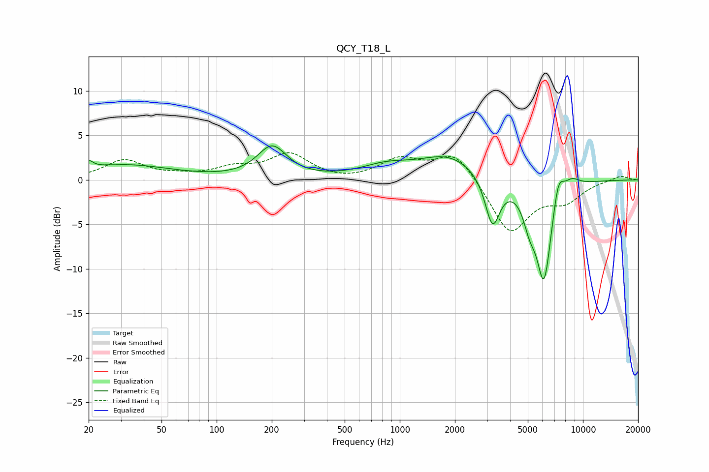

# QCY_T18_L
See [usage instructions](https://github.com/jaakkopasanen/AutoEq#usage) for more options and info.

### Parametric EQs
Apply preamp of -3.9 dB when using parametric equalizer.

|   # | Type    |   Fc (Hz) |    Q |   Gain (dB) |
|-----|---------|-----------|------|-------------|
|   1 | Peaking |        20 | 5.93 |         0.8 |
|   2 | Peaking |        31 | 0.55 |         1.7 |
|   3 | Peaking |       201 | 1.76 |         3.6 |
|   4 | Peaking |       836 | 1.02 |         1.3 |
|   5 | Peaking |      1870 | 0.86 |         2.7 |
|   6 | Peaking |      3208 | 3.49 |        -5.6 |
|   7 | Peaking |      5105 | 4.14 |        -2.5 |
|   8 | Peaking |      6127 | 3.04 |       -11.5 |
|   9 | Peaking |      7329 | 4.41 |         3.3 |
|  10 | Peaking |      8649 | 2.93 |         1.1 |

### Fixed Band EQs
When using fixed band (also called graphic) equalizer, apply preamp of **-3.1 dB** (if available) and set gains manually with these parameters.

|   # | Type    |   Fc (Hz) |    Q |   Gain (dB) |
|-----|---------|-----------|------|-------------|
|   1 | Peaking |        31 | 1.41 |         2.1 |
|   2 | Peaking |        62 | 1.41 |         0.3 |
|   3 | Peaking |       125 | 1.41 |         1.2 |
|   4 | Peaking |       250 | 1.41 |         2.8 |
|   5 | Peaking |       500 | 1.41 |        -0.3 |
|   6 | Peaking |      1000 | 1.41 |         2.2 |
|   7 | Peaking |      2000 | 1.41 |         3.2 |
|   8 | Peaking |      4000 | 1.41 |        -6   |
|   9 | Peaking |      8000 | 1.41 |        -2.1 |
|  10 | Peaking |     16000 | 1.41 |         0.5 |

### Graphs

