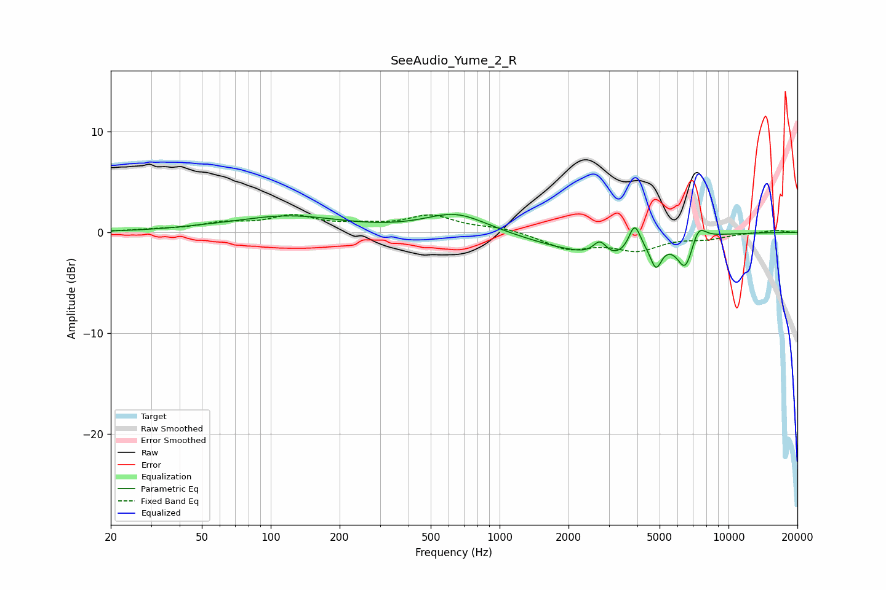

# SeeAudio_Yume_2_R
See [usage instructions](https://github.com/jaakkopasanen/AutoEq#usage) for more options and info.

### Parametric EQs
Apply preamp of -1.9 dB when using parametric equalizer.

|   # | Type    |   Fc (Hz) |    Q |   Gain (dB) |
|-----|---------|-----------|------|-------------|
|   1 | Peaking |        48 | 1    |         0.1 |
|   2 | Peaking |       119 | 0.61 |         1.6 |
|   3 | Peaking |       646 | 1.05 |         1.9 |
|   4 | Peaking |      1896 | 0.74 |        -1.1 |
|   5 | Peaking |      2745 | 4.63 |         1.6 |
|   6 | Peaking |      3081 | 1.25 |        -2.1 |
|   7 | Peaking |      3889 | 5.52 |         2.7 |
|   8 | Peaking |      4822 | 5.7  |        -2.4 |
|   9 | Peaking |      6487 | 3.74 |        -3.4 |
|  10 | Peaking |      7367 | 4.12 |         1.8 |

### Fixed Band EQs
When using fixed band (also called graphic) equalizer, apply preamp of **-1.8 dB** (if available) and set gains manually with these parameters.

|   # | Type    |   Fc (Hz) |    Q |   Gain (dB) |
|-----|---------|-----------|------|-------------|
|   1 | Peaking |        31 | 1.41 |         0.2 |
|   2 | Peaking |        62 | 1.41 |         0.8 |
|   3 | Peaking |       125 | 1.41 |         1.4 |
|   4 | Peaking |       250 | 1.41 |         0.5 |
|   5 | Peaking |       500 | 1.41 |         1.6 |
|   6 | Peaking |      1000 | 1.41 |         0.4 |
|   7 | Peaking |      2000 | 1.41 |        -1.6 |
|   8 | Peaking |      4000 | 1.41 |        -1.6 |
|   9 | Peaking |      8000 | 1.41 |        -0.5 |
|  10 | Peaking |     16000 | 1.41 |         0.2 |

### Graphs

