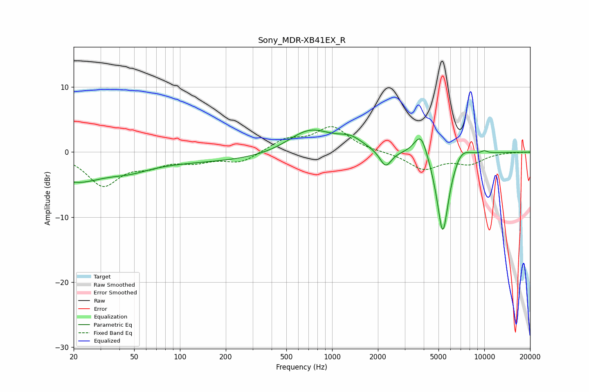

# Sony_MDR-XB41EX_R
See [usage instructions](https://github.com/jaakkopasanen/AutoEq#usage) for more options and info.

### Parametric EQs
Apply preamp of -3.5 dB when using parametric equalizer.

|   # | Type    |   Fc (Hz) |    Q |   Gain (dB) |
|-----|---------|-----------|------|-------------|
|   1 | Peaking |        20 | 0.76 |        -3.8 |
|   2 | Peaking |        47 | 1.08 |        -1   |
|   3 | Peaking |       139 | 0.18 |        -1.5 |
|   4 | Peaking |       712 | 0.94 |         4   |
|   5 | Peaking |      1323 | 1.74 |         1.5 |
|   6 | Peaking |      2247 | 3.69 |        -2.6 |
|   7 | Peaking |      3841 | 3.08 |         4.1 |
|   8 | Peaking |      5336 | 3.35 |       -13.3 |
|   9 | Peaking |      7026 | 2.38 |         1.9 |
|  10 | Peaking |     10000 | 5.99 |         0.4 |

### Fixed Band EQs
When using fixed band (also called graphic) equalizer, apply preamp of **-4.0 dB** (if available) and set gains manually with these parameters.

|   # | Type    |   Fc (Hz) |    Q |   Gain (dB) |
|-----|---------|-----------|------|-------------|
|   1 | Peaking |        31 | 1.41 |        -4.9 |
|   2 | Peaking |        62 | 1.41 |        -1.6 |
|   3 | Peaking |       125 | 1.41 |        -1.2 |
|   4 | Peaking |       250 | 1.41 |        -1.6 |
|   5 | Peaking |       500 | 1.41 |         1.8 |
|   6 | Peaking |      1000 | 1.41 |         3.7 |
|   7 | Peaking |      2000 | 1.41 |         0   |
|   8 | Peaking |      4000 | 1.41 |        -2.6 |
|   9 | Peaking |      8000 | 1.41 |        -1.6 |
|  10 | Peaking |     16000 | 1.41 |         0   |

### Graphs

