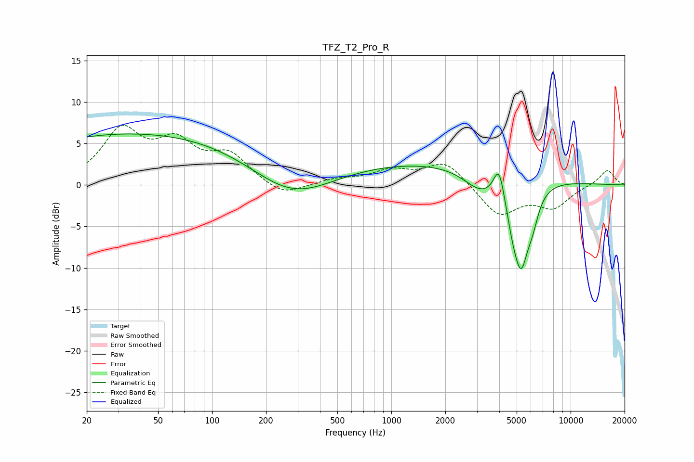

# TFZ_T2_Pro_R
See [usage instructions](https://github.com/jaakkopasanen/AutoEq#usage) for more options and info.

### Parametric EQs
Apply preamp of -6.2 dB when using parametric equalizer.

|   # | Type    |   Fc (Hz) |    Q |   Gain (dB) |
|-----|---------|-----------|------|-------------|
|   1 | Peaking |        40 | 0.18 |         6.3 |
|   2 | Peaking |       278 | 0.6  |        -4.9 |
|   3 | Peaking |      1160 | 0.18 |         3   |
|   4 | Peaking |      3119 | 1.51 |        -2.3 |
|   5 | Peaking |      3821 | 5.34 |         0.7 |
|   6 | Peaking |      3993 | 5.76 |         2.2 |
|   7 | Peaking |      4126 | 4.57 |         1   |
|   8 | Peaking |      4767 | 3.41 |        -3   |
|   9 | Peaking |      5307 | 3.11 |        -9   |
|  10 | Peaking |      6160 | 4.13 |        -2.4 |

### Fixed Band EQs
When using fixed band (also called graphic) equalizer, apply preamp of **-7.3 dB** (if available) and set gains manually with these parameters.

|   # | Type    |   Fc (Hz) |    Q |   Gain (dB) |
|-----|---------|-----------|------|-------------|
|   1 | Peaking |        31 | 1.41 |         6.2 |
|   2 | Peaking |        62 | 1.41 |         4.4 |
|   3 | Peaking |       125 | 1.41 |         3.3 |
|   4 | Peaking |       250 | 1.41 |        -1.6 |
|   5 | Peaking |       500 | 1.41 |         0.6 |
|   6 | Peaking |      1000 | 1.41 |         1.6 |
|   7 | Peaking |      2000 | 1.41 |         2.8 |
|   8 | Peaking |      4000 | 1.41 |        -3.7 |
|   9 | Peaking |      8000 | 1.41 |        -2.5 |
|  10 | Peaking |     16000 | 1.41 |         1.9 |

### Graphs

