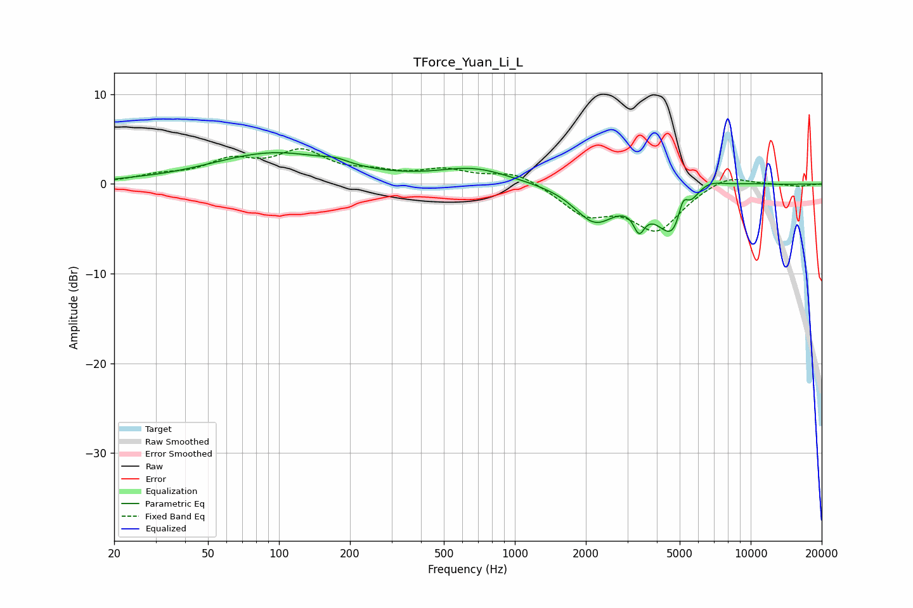

# TForce_Yuan_Li_L
See [usage instructions](https://github.com/jaakkopasanen/AutoEq#usage) for more options and info.

### Parametric EQs
Apply preamp of -3.6 dB when using parametric equalizer.

|   # | Type    |   Fc (Hz) |    Q |   Gain (dB) |
|-----|---------|-----------|------|-------------|
|   1 | Peaking |        25 | 2.01 |         0.1 |
|   2 | Peaking |        96 | 0.53 |         3.4 |
|   3 | Peaking |       174 | 2.74 |         0.5 |
|   4 | Peaking |       672 | 0.92 |         1.7 |
|   5 | Peaking |      2179 | 1.63 |        -3.9 |
|   6 | Peaking |      3363 | 5.99 |        -2.5 |
|   7 | Peaking |      4819 | 1.83 |        -6.9 |
|   8 | Peaking |      5159 | 5.98 |         3.2 |
|   9 | Peaking |      6255 | 1.71 |         2.4 |
|  10 | Peaking |     10000 | 1.93 |         0.1 |

### Fixed Band EQs
When using fixed band (also called graphic) equalizer, apply preamp of **-4.0 dB** (if available) and set gains manually with these parameters.

|   # | Type    |   Fc (Hz) |    Q |   Gain (dB) |
|-----|---------|-----------|------|-------------|
|   1 | Peaking |        31 | 1.41 |         0.8 |
|   2 | Peaking |        62 | 1.41 |         2.3 |
|   3 | Peaking |       125 | 1.41 |         3.3 |
|   4 | Peaking |       250 | 1.41 |         0.9 |
|   5 | Peaking |       500 | 1.41 |         1.4 |
|   6 | Peaking |      1000 | 1.41 |         1.4 |
|   7 | Peaking |      2000 | 1.41 |        -3.2 |
|   8 | Peaking |      4000 | 1.41 |        -4.9 |
|   9 | Peaking |      8000 | 1.41 |         1.2 |
|  10 | Peaking |     16000 | 1.41 |        -0.3 |

### Graphs

