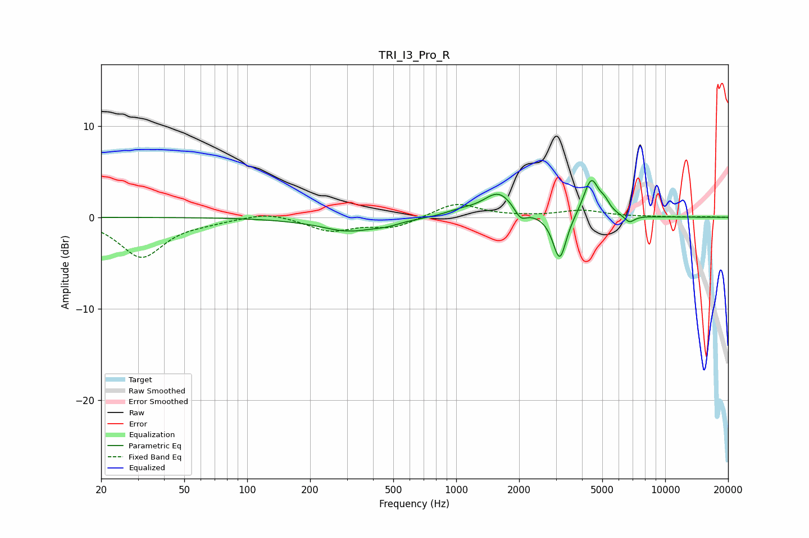

# TRI_I3_Pro_R
See [usage instructions](https://github.com/jaakkopasanen/AutoEq#usage) for more options and info.

### Parametric EQs
Apply preamp of -4.1 dB when using parametric equalizer.

|   # | Type    |   Fc (Hz) |    Q |   Gain (dB) |
|-----|---------|-----------|------|-------------|
|   1 | Peaking |       227 | 1.65 |         0.2 |
|   2 | Peaking |       298 | 0.96 |        -1.6 |
|   3 | Peaking |       466 | 2.49 |        -0.3 |
|   4 | Peaking |      1053 | 1.83 |         0.5 |
|   5 | Peaking |      1596 | 1.96 |         2.7 |
|   6 | Peaking |      2033 | 4.94 |        -1.2 |
|   7 | Peaking |      3128 | 4.42 |        -5   |
|   8 | Peaking |      4429 | 3.78 |         4.2 |
|   9 | Peaking |      5142 | 5.99 |         0.8 |
|  10 | Peaking |      6746 | 5.59 |        -0.8 |

### Fixed Band EQs
When using fixed band (also called graphic) equalizer, apply preamp of **-1.5 dB** (if available) and set gains manually with these parameters.

|   # | Type    |   Fc (Hz) |    Q |   Gain (dB) |
|-----|---------|-----------|------|-------------|
|   1 | Peaking |        31 | 1.41 |        -4.3 |
|   2 | Peaking |        62 | 1.41 |        -0.3 |
|   3 | Peaking |       125 | 1.41 |         0.6 |
|   4 | Peaking |       250 | 1.41 |        -1.4 |
|   5 | Peaking |       500 | 1.41 |        -1.1 |
|   6 | Peaking |      1000 | 1.41 |         1.6 |
|   7 | Peaking |      2000 | 1.41 |         0   |
|   8 | Peaking |      4000 | 1.41 |         0.7 |
|   9 | Peaking |      8000 | 1.41 |         0   |
|  10 | Peaking |     16000 | 1.41 |         0   |

### Graphs

