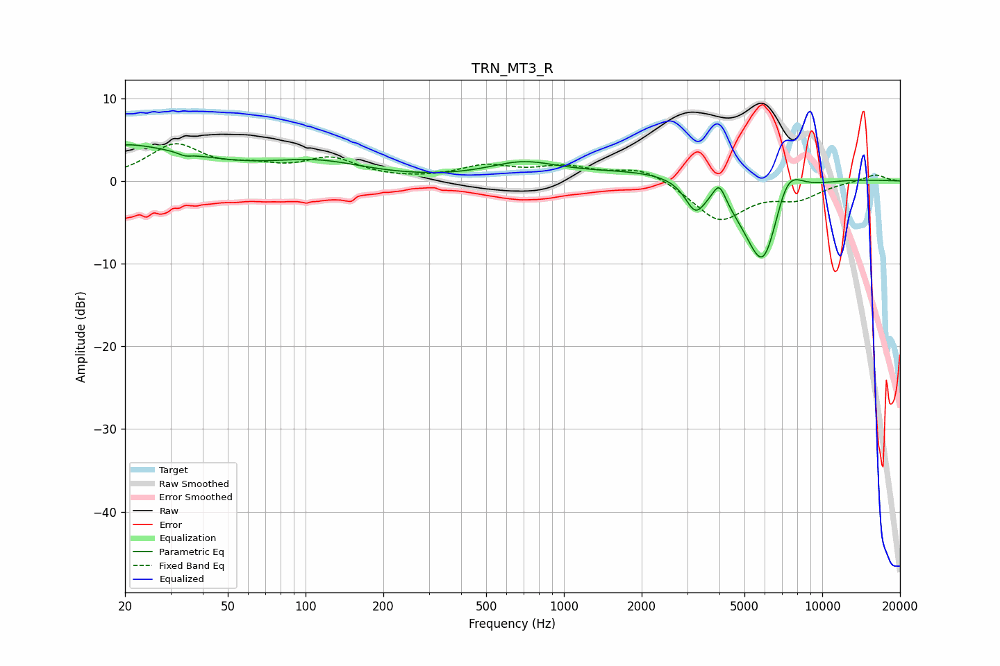

# TRN_MT3_R
See [usage instructions](https://github.com/jaakkopasanen/AutoEq#usage) for more options and info.

### Parametric EQs
Apply preamp of -4.5 dB when using parametric equalizer.

|   # | Type    |   Fc (Hz) |    Q |   Gain (dB) |
|-----|---------|-----------|------|-------------|
|   1 | Peaking |        20 | 1.95 |         0.4 |
|   2 | Peaking |        21 | 0.52 |         3.8 |
|   3 | Peaking |        34 | 5.72 |        -0.4 |
|   4 | Peaking |       111 | 0.75 |         2   |
|   5 | Peaking |       693 | 1.05 |         1.9 |
|   6 | Peaking |      3225 | 3.59 |        -3.4 |
|   7 | Peaking |      3994 | 5.66 |         2.5 |
|   8 | Peaking |      4146 | 0.32 |         2.2 |
|   9 | Peaking |      5931 | 1.56 |       -14.1 |
|  10 | Peaking |      7267 | 2.12 |         6   |

### Fixed Band EQs
When using fixed band (also called graphic) equalizer, apply preamp of **-4.6 dB** (if available) and set gains manually with these parameters.

|   # | Type    |   Fc (Hz) |    Q |   Gain (dB) |
|-----|---------|-----------|------|-------------|
|   1 | Peaking |        31 | 1.41 |         4.2 |
|   2 | Peaking |        62 | 1.41 |         1.2 |
|   3 | Peaking |       125 | 1.41 |         2.5 |
|   4 | Peaking |       250 | 1.41 |        -0   |
|   5 | Peaking |       500 | 1.41 |         1.6 |
|   6 | Peaking |      1000 | 1.41 |         1.5 |
|   7 | Peaking |      2000 | 1.41 |         1.7 |
|   8 | Peaking |      4000 | 1.41 |        -4.7 |
|   9 | Peaking |      8000 | 1.41 |        -1.9 |
|  10 | Peaking |     16000 | 1.41 |         0.8 |

### Graphs

