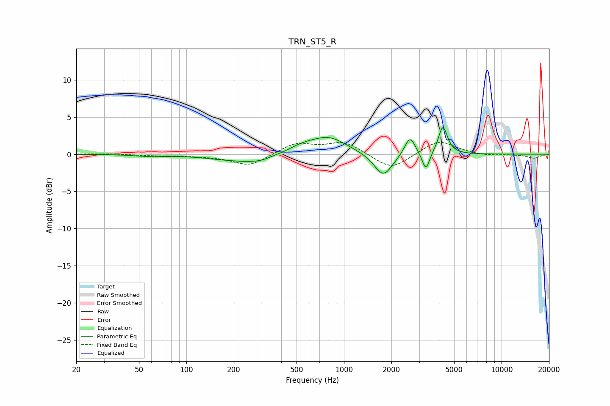

# TRN_ST5_R
See [usage instructions](https://github.com/jaakkopasanen/AutoEq#usage) for more options and info.

### Parametric EQs
Apply preamp of -3.7 dB when using parametric equalizer.

|   # | Type    |   Fc (Hz) |    Q |   Gain (dB) |
|-----|---------|-----------|------|-------------|
|   1 | Peaking |        60 | 1.56 |        -0.2 |
|   2 | Peaking |       188 | 0.87 |        -0.5 |
|   3 | Peaking |       308 | 1.06 |        -1   |
|   4 | Peaking |       359 | 3.12 |         0.2 |
|   5 | Peaking |       528 | 1.44 |         0.9 |
|   6 | Peaking |       801 | 1.23 |         2.2 |
|   7 | Peaking |      1776 | 2.44 |        -3.2 |
|   8 | Peaking |      2623 | 4.21 |         2.6 |
|   9 | Peaking |      3308 | 6    |        -2.5 |
|  10 | Peaking |      4242 | 5.04 |         3.8 |

### Fixed Band EQs
When using fixed band (also called graphic) equalizer, apply preamp of **-1.7 dB** (if available) and set gains manually with these parameters.

|   # | Type    |   Fc (Hz) |    Q |   Gain (dB) |
|-----|---------|-----------|------|-------------|
|   1 | Peaking |        31 | 1.41 |         0.1 |
|   2 | Peaking |        62 | 1.41 |        -0.2 |
|   3 | Peaking |       125 | 1.41 |        -0.2 |
|   4 | Peaking |       250 | 1.41 |        -1.6 |
|   5 | Peaking |       500 | 1.41 |         1.5 |
|   6 | Peaking |      1000 | 1.41 |         1.6 |
|   7 | Peaking |      2000 | 1.41 |        -2.2 |
|   8 | Peaking |      4000 | 1.41 |         1.9 |
|   9 | Peaking |      8000 | 1.41 |        -0.2 |
|  10 | Peaking |     16000 | 1.41 |        -0.5 |

### Graphs

