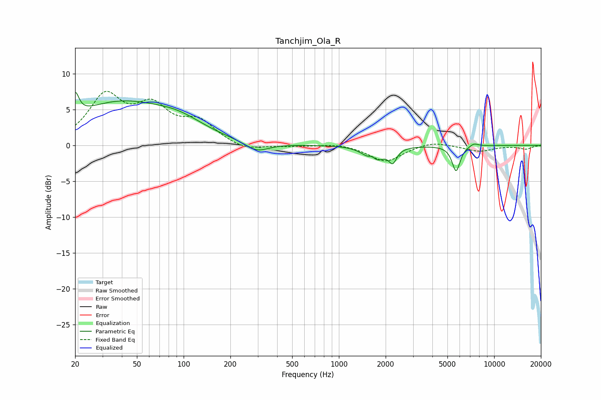

# Tanchjim_Ola_R
See [usage instructions](https://github.com/jaakkopasanen/AutoEq#usage) for more options and info.

### Parametric EQs
Apply preamp of -7.5 dB when using parametric equalizer.

|   # | Type    |   Fc (Hz) |    Q |   Gain (dB) |
|-----|---------|-----------|------|-------------|
|   1 | Peaking |        20 | 5.96 |         3.2 |
|   2 | Peaking |        38 | 0.45 |         5.7 |
|   3 | Peaking |        94 | 0.86 |         1.7 |
|   4 | Peaking |       297 | 1.87 |        -1.3 |
|   5 | Peaking |      1638 | 2.96 |        -1.9 |
|   6 | Peaking |      1643 | 4.87 |         1.7 |
|   7 | Peaking |      1721 | 2.97 |        -1.3 |
|   8 | Peaking |      2221 | 5.62 |        -1.9 |
|   9 | Peaking |      5686 | 5.39 |        -3.6 |
|  10 | Peaking |      7407 | 4.78 |         0.5 |

### Fixed Band EQs
When using fixed band (also called graphic) equalizer, apply preamp of **-7.6 dB** (if available) and set gains manually with these parameters.

|   # | Type    |   Fc (Hz) |    Q |   Gain (dB) |
|-----|---------|-----------|------|-------------|
|   1 | Peaking |        31 | 1.41 |         6.5 |
|   2 | Peaking |        62 | 1.41 |         4.7 |
|   3 | Peaking |       125 | 1.41 |         2.9 |
|   4 | Peaking |       250 | 1.41 |        -0.9 |
|   5 | Peaking |       500 | 1.41 |        -0.1 |
|   6 | Peaking |      1000 | 1.41 |         0.3 |
|   7 | Peaking |      2000 | 1.41 |        -2.3 |
|   8 | Peaking |      4000 | 1.41 |         0.7 |
|   9 | Peaking |      8000 | 1.41 |        -0.8 |
|  10 | Peaking |     16000 | 1.41 |        -0.5 |

### Graphs

