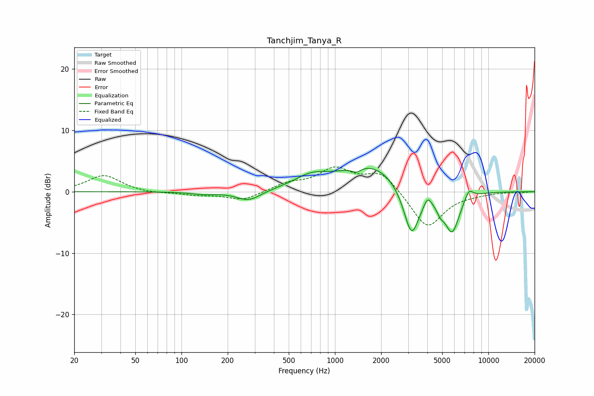

# Tanchjim_Tanya_R
See [usage instructions](https://github.com/jaakkopasanen/AutoEq#usage) for more options and info.

### Parametric EQs
Apply preamp of -3.9 dB when using parametric equalizer.

|   # | Type    |   Fc (Hz) |    Q |   Gain (dB) |
|-----|---------|-----------|------|-------------|
|   1 | Peaking |       140 | 1.67 |        -0.4 |
|   2 | Peaking |       274 | 1.81 |        -1.6 |
|   3 | Peaking |       701 | 1.25 |         1.9 |
|   4 | Peaking |      1382 | 4.85 |        -0.8 |
|   5 | Peaking |      1738 | 0.72 |         4.4 |
|   6 | Peaking |      3154 | 2.67 |        -8.4 |
|   7 | Peaking |      4019 | 6    |         1.4 |
|   8 | Peaking |      4856 | 5.29 |        -1.4 |
|   9 | Peaking |      5801 | 2.78 |        -6.6 |
|  10 | Peaking |      7457 | 4.8  |         1.7 |

### Fixed Band EQs
When using fixed band (also called graphic) equalizer, apply preamp of **-4.1 dB** (if available) and set gains manually with these parameters.

|   # | Type    |   Fc (Hz) |    Q |   Gain (dB) |
|-----|---------|-----------|------|-------------|
|   1 | Peaking |        31 | 1.41 |         2.7 |
|   2 | Peaking |        62 | 1.41 |        -0.3 |
|   3 | Peaking |       125 | 1.41 |        -0.5 |
|   4 | Peaking |       250 | 1.41 |        -1.4 |
|   5 | Peaking |       500 | 1.41 |         1.2 |
|   6 | Peaking |      1000 | 1.41 |         3.5 |
|   7 | Peaking |      2000 | 1.41 |         3.2 |
|   8 | Peaking |      4000 | 1.41 |        -6   |
|   9 | Peaking |      8000 | 1.41 |        -0.3 |
|  10 | Peaking |     16000 | 1.41 |        -0.1 |

### Graphs

