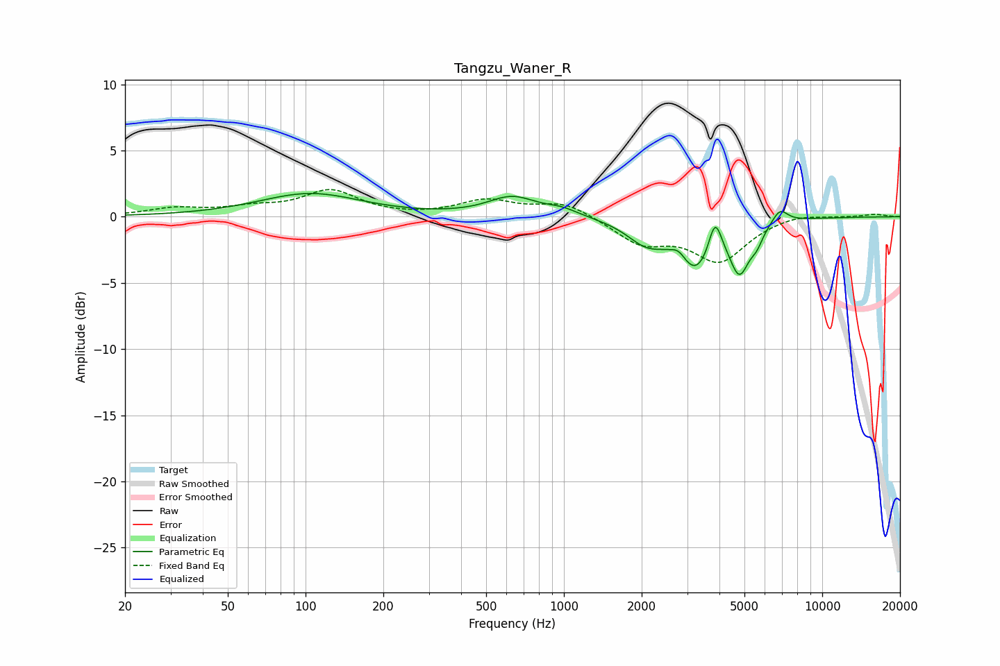

# Tangzu_Waner_R
See [usage instructions](https://github.com/jaakkopasanen/AutoEq#usage) for more options and info.

### Parametric EQs
Apply preamp of -1.9 dB when using parametric equalizer.

|   # | Type    |   Fc (Hz) |    Q |   Gain (dB) |
|-----|---------|-----------|------|-------------|
|   1 | Peaking |       104 | 0.72 |         1.7 |
|   2 | Peaking |       631 | 1.5  |         1.4 |
|   3 | Peaking |       983 | 2.2  |         0.5 |
|   4 | Peaking |      2079 | 1.88 |        -1.6 |
|   5 | Peaking |      2787 | 4.84 |         0.7 |
|   6 | Peaking |      3241 | 1.92 |        -3.8 |
|   7 | Peaking |      3847 | 5.59 |         2.7 |
|   8 | Peaking |      4785 | 3.72 |        -3.5 |
|   9 | Peaking |      5573 | 5.65 |        -0.9 |
|  10 | Peaking |      6857 | 4.46 |         1.1 |

### Fixed Band EQs
When using fixed band (also called graphic) equalizer, apply preamp of **-2.1 dB** (if available) and set gains manually with these parameters.

|   # | Type    |   Fc (Hz) |    Q |   Gain (dB) |
|-----|---------|-----------|------|-------------|
|   1 | Peaking |        31 | 1.41 |         0.6 |
|   2 | Peaking |        62 | 1.41 |         0.5 |
|   3 | Peaking |       125 | 1.41 |         1.9 |
|   4 | Peaking |       250 | 1.41 |        -0   |
|   5 | Peaking |       500 | 1.41 |         1.2 |
|   6 | Peaking |      1000 | 1.41 |         1.1 |
|   7 | Peaking |      2000 | 1.41 |        -1.9 |
|   8 | Peaking |      4000 | 1.41 |        -3.2 |
|   9 | Peaking |      8000 | 1.41 |         0.3 |
|  10 | Peaking |     16000 | 1.41 |         0.2 |

### Graphs

