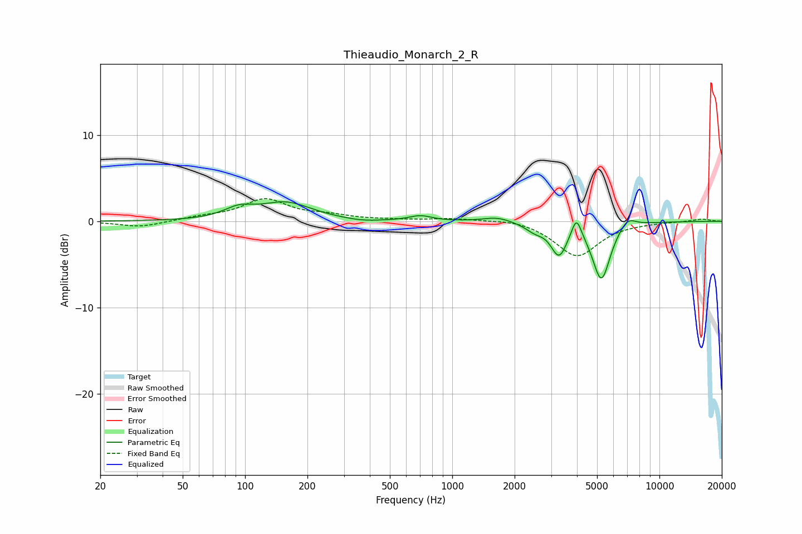

# Thieaudio_Monarch_2_R
See [usage instructions](https://github.com/jaakkopasanen/AutoEq#usage) for more options and info.

### Parametric EQs
Apply preamp of -2.4 dB when using parametric equalizer.

|   # | Type    |   Fc (Hz) |    Q |   Gain (dB) |
|-----|---------|-----------|------|-------------|
|   1 | Peaking |        94 | 1.94 |         1.2 |
|   2 | Peaking |       158 | 1.16 |         2.1 |
|   3 | Peaking |       369 | 1.81 |        -0.2 |
|   4 | Peaking |       702 | 2.67 |         0.6 |
|   5 | Peaking |      1649 | 2.11 |         0.6 |
|   6 | Peaking |      2496 | 3.14 |        -0.8 |
|   7 | Peaking |      3276 | 3.64 |        -3.6 |
|   8 | Peaking |      3978 | 6    |         2.4 |
|   9 | Peaking |      5246 | 3.21 |        -6.7 |
|  10 | Peaking |      7010 | 3.37 |         1.2 |

### Fixed Band EQs
When using fixed band (also called graphic) equalizer, apply preamp of **-2.7 dB** (if available) and set gains manually with these parameters.

|   # | Type    |   Fc (Hz) |    Q |   Gain (dB) |
|-----|---------|-----------|------|-------------|
|   1 | Peaking |        31 | 1.41 |        -0.7 |
|   2 | Peaking |        62 | 1.41 |         0.4 |
|   3 | Peaking |       125 | 1.41 |         2.5 |
|   4 | Peaking |       250 | 1.41 |         0.5 |
|   5 | Peaking |       500 | 1.41 |         0.1 |
|   6 | Peaking |      1000 | 1.41 |         0.3 |
|   7 | Peaking |      2000 | 1.41 |         0.4 |
|   8 | Peaking |      4000 | 1.41 |        -4.1 |
|   9 | Peaking |      8000 | 1.41 |        -0.1 |
|  10 | Peaking |     16000 | 1.41 |         0.3 |

### Graphs

