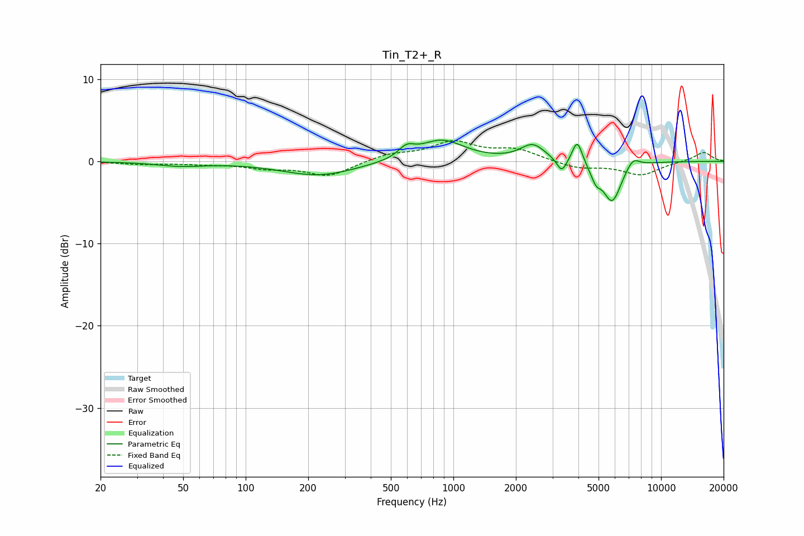

# Tin_T2+_R
See [usage instructions](https://github.com/jaakkopasanen/AutoEq#usage) for more options and info.

### Parametric EQs
Apply preamp of -2.7 dB when using parametric equalizer.

|   # | Type    |   Fc (Hz) |    Q |   Gain (dB) |
|-----|---------|-----------|------|-------------|
|   1 | Peaking |        48 | 1.21 |        -0.5 |
|   2 | Peaking |       225 | 0.79 |        -1.7 |
|   3 | Peaking |       595 | 3.7  |         1.2 |
|   4 | Peaking |       877 | 1.3  |         2.6 |
|   5 | Peaking |      2411 | 2.42 |         2   |
|   6 | Peaking |      3325 | 6    |        -1.7 |
|   7 | Peaking |      3950 | 5.95 |         2.8 |
|   8 | Peaking |      4858 | 5.71 |        -1.6 |
|   9 | Peaking |      5814 | 3.13 |        -4.9 |
|  10 | Peaking |      7316 | 4.27 |         1.2 |

### Fixed Band EQs
When using fixed band (also called graphic) equalizer, apply preamp of **-2.6 dB** (if available) and set gains manually with these parameters.

|   # | Type    |   Fc (Hz) |    Q |   Gain (dB) |
|-----|---------|-----------|------|-------------|
|   1 | Peaking |        31 | 1.41 |        -0.3 |
|   2 | Peaking |        62 | 1.41 |        -0.3 |
|   3 | Peaking |       125 | 1.41 |        -0.7 |
|   4 | Peaking |       250 | 1.41 |        -1.8 |
|   5 | Peaking |       500 | 1.41 |         0.8 |
|   6 | Peaking |      1000 | 1.41 |         2.2 |
|   7 | Peaking |      2000 | 1.41 |         1.3 |
|   8 | Peaking |      4000 | 1.41 |        -0.8 |
|   9 | Peaking |      8000 | 1.41 |        -1.6 |
|  10 | Peaking |     16000 | 1.41 |         1.2 |

### Graphs

