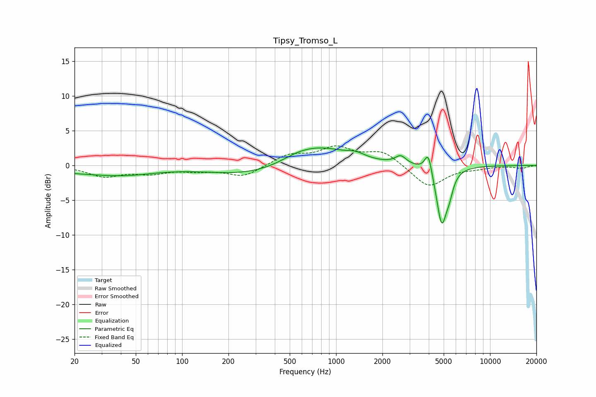

# Tipsy_Tromso_L
See [usage instructions](https://github.com/jaakkopasanen/AutoEq#usage) for more options and info.

### Parametric EQs
Apply preamp of -2.6 dB when using parametric equalizer.

|   # | Type    |   Fc (Hz) |    Q |   Gain (dB) |
|-----|---------|-----------|------|-------------|
|   1 | Peaking |        25 | 0.41 |        -1   |
|   2 | Peaking |        45 | 0.86 |        -0.5 |
|   3 | Peaking |       274 | 0.54 |        -1.4 |
|   4 | Peaking |       556 | 1.45 |         0.5 |
|   5 | Peaking |       773 | 0.76 |         2.7 |
|   6 | Peaking |      1348 | 2.38 |         0.7 |
|   7 | Peaking |      2629 | 4.02 |         1.2 |
|   8 | Peaking |      3972 | 6    |         3.1 |
|   9 | Peaking |      4853 | 4.06 |        -8.3 |
|  10 | Peaking |      5450 | 6    |        -1.7 |

### Fixed Band EQs
When using fixed band (also called graphic) equalizer, apply preamp of **-2.9 dB** (if available) and set gains manually with these parameters.

|   # | Type    |   Fc (Hz) |    Q |   Gain (dB) |
|-----|---------|-----------|------|-------------|
|   1 | Peaking |        31 | 1.41 |        -1.5 |
|   2 | Peaking |        62 | 1.41 |        -1   |
|   3 | Peaking |       125 | 1.41 |        -0.6 |
|   4 | Peaking |       250 | 1.41 |        -1.6 |
|   5 | Peaking |       500 | 1.41 |         1.5 |
|   6 | Peaking |      1000 | 1.41 |         2.4 |
|   7 | Peaking |      2000 | 1.41 |         2   |
|   8 | Peaking |      4000 | 1.41 |        -3.2 |
|   9 | Peaking |      8000 | 1.41 |        -0.3 |
|  10 | Peaking |     16000 | 1.41 |        -0.4 |

### Graphs

