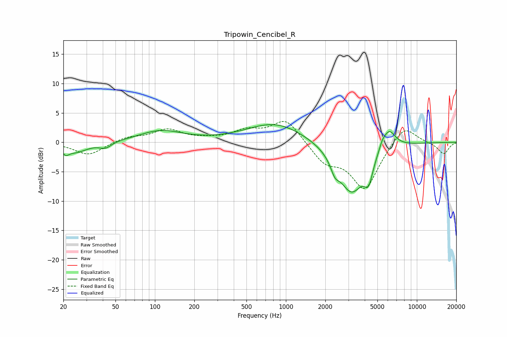

# Tripowin_Cencibel_R
See [usage instructions](https://github.com/jaakkopasanen/AutoEq#usage) for more options and info.

### Parametric EQs
Apply preamp of -3.1 dB when using parametric equalizer.

|   # | Type    |   Fc (Hz) |    Q |   Gain (dB) |
|-----|---------|-----------|------|-------------|
|   1 | Peaking |        21 | 5.65 |        -1   |
|   2 | Peaking |        25 | 1.52 |        -1.7 |
|   3 | Peaking |        42 | 3.2  |        -1   |
|   4 | Peaking |       111 | 0.85 |         1.9 |
|   5 | Peaking |       834 | 0.64 |         3.3 |
|   6 | Peaking |      2367 | 4.49 |        -1.9 |
|   7 | Peaking |      3166 | 1.35 |        -8.6 |
|   8 | Peaking |      4280 | 4.46 |        -3.5 |
|   9 | Peaking |      5437 | 6    |         0.9 |
|  10 | Peaking |      6113 | 2.72 |         3.4 |

### Fixed Band EQs
When using fixed band (also called graphic) equalizer, apply preamp of **-3.6 dB** (if available) and set gains manually with these parameters.

|   # | Type    |   Fc (Hz) |    Q |   Gain (dB) |
|-----|---------|-----------|------|-------------|
|   1 | Peaking |        31 | 1.41 |        -2.2 |
|   2 | Peaking |        62 | 1.41 |         0.9 |
|   3 | Peaking |       125 | 1.41 |         2.1 |
|   4 | Peaking |       250 | 1.41 |         0.4 |
|   5 | Peaking |       500 | 1.41 |         1.7 |
|   6 | Peaking |      1000 | 1.41 |         4   |
|   7 | Peaking |      2000 | 1.41 |        -3.2 |
|   8 | Peaking |      4000 | 1.41 |        -7.9 |
|   9 | Peaking |      8000 | 1.41 |         3.3 |
|  10 | Peaking |     16000 | 1.41 |        -2   |

### Graphs

