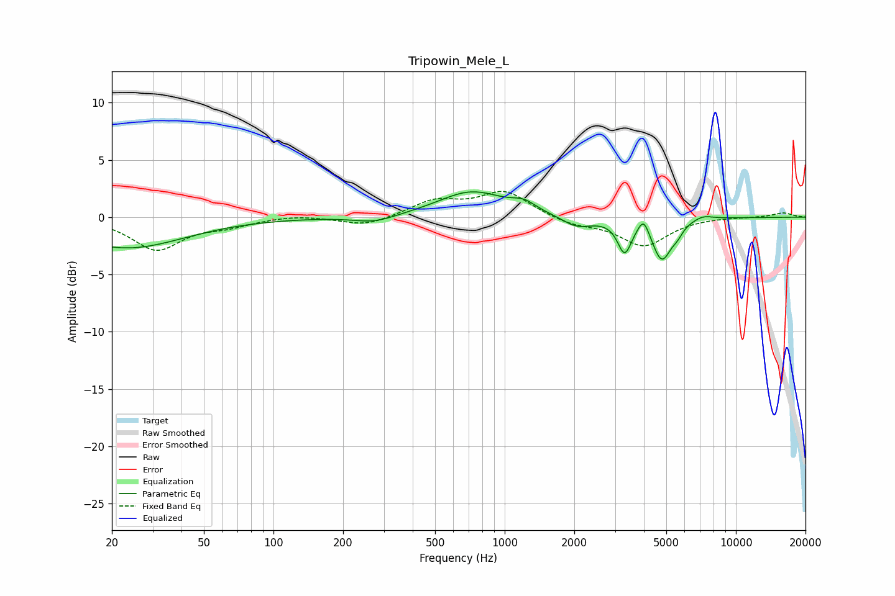

# Tripowin_Mele_L
See [usage instructions](https://github.com/jaakkopasanen/AutoEq#usage) for more options and info.

### Parametric EQs
Apply preamp of -2.3 dB when using parametric equalizer.

|   # | Type    |   Fc (Hz) |    Q |   Gain (dB) |
|-----|---------|-----------|------|-------------|
|   1 | Peaking |        23 | 0.57 |        -2.7 |
|   2 | Peaking |       274 | 1.57 |        -0.6 |
|   3 | Peaking |       720 | 0.99 |         2.2 |
|   4 | Peaking |      1211 | 2.71 |         0.7 |
|   5 | Peaking |      2055 | 2.13 |        -1   |
|   6 | Peaking |      3300 | 4.73 |        -2.8 |
|   7 | Peaking |      3991 | 5.99 |         1.4 |
|   8 | Peaking |      4781 | 3.32 |        -3.6 |
|   9 | Peaking |      5585 | 5.94 |        -0.6 |
|  10 | Peaking |      7198 | 3.15 |         0.4 |

### Fixed Band EQs
When using fixed band (also called graphic) equalizer, apply preamp of **-2.3 dB** (if available) and set gains manually with these parameters.

|   # | Type    |   Fc (Hz) |    Q |   Gain (dB) |
|-----|---------|-----------|------|-------------|
|   1 | Peaking |        31 | 1.41 |        -2.8 |
|   2 | Peaking |        62 | 1.41 |        -0.6 |
|   3 | Peaking |       125 | 1.41 |         0.2 |
|   4 | Peaking |       250 | 1.41 |        -0.8 |
|   5 | Peaking |       500 | 1.41 |         1.4 |
|   6 | Peaking |      1000 | 1.41 |         2.2 |
|   7 | Peaking |      2000 | 1.41 |        -0.6 |
|   8 | Peaking |      4000 | 1.41 |        -2.5 |
|   9 | Peaking |      8000 | 1.41 |         0   |
|  10 | Peaking |     16000 | 1.41 |         0.4 |

### Graphs

