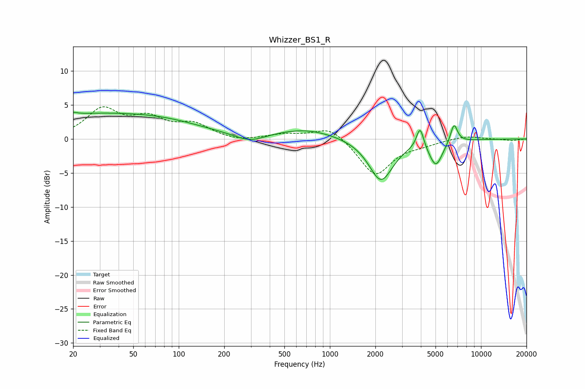

# Whizzer_BS1_R
See [usage instructions](https://github.com/jaakkopasanen/AutoEq#usage) for more options and info.

### Parametric EQs
Apply preamp of -4.0 dB when using parametric equalizer.

|   # | Type    |   Fc (Hz) |    Q |   Gain (dB) |
|-----|---------|-----------|------|-------------|
|   1 | Peaking |        20 | 6    |        -2.8 |
|   2 | Peaking |        20 | 5.97 |         3.1 |
|   3 | Peaking |        28 | 0.23 |         3.7 |
|   4 | Peaking |        88 | 0.62 |         0.5 |
|   5 | Peaking |       295 | 1.42 |        -1.2 |
|   6 | Peaking |       689 | 0.7  |         1.5 |
|   7 | Peaking |      2177 | 1.76 |        -6.2 |
|   8 | Peaking |      3951 | 6    |         3.1 |
|   9 | Peaking |      5028 | 3.17 |        -3.7 |
|  10 | Peaking |      6625 | 5.8  |         2.8 |

### Fixed Band EQs
When using fixed band (also called graphic) equalizer, apply preamp of **-4.8 dB** (if available) and set gains manually with these parameters.

|   # | Type    |   Fc (Hz) |    Q |   Gain (dB) |
|-----|---------|-----------|------|-------------|
|   1 | Peaking |        31 | 1.41 |         4.2 |
|   2 | Peaking |        62 | 1.41 |         2.6 |
|   3 | Peaking |       125 | 1.41 |         2   |
|   4 | Peaking |       250 | 1.41 |        -0.4 |
|   5 | Peaking |       500 | 1.41 |         0.6 |
|   6 | Peaking |      1000 | 1.41 |         2   |
|   7 | Peaking |      2000 | 1.41 |        -5.4 |
|   8 | Peaking |      4000 | 1.41 |        -0.6 |
|   9 | Peaking |      8000 | 1.41 |         0.5 |
|  10 | Peaking |     16000 | 1.41 |        -0.2 |

### Graphs

