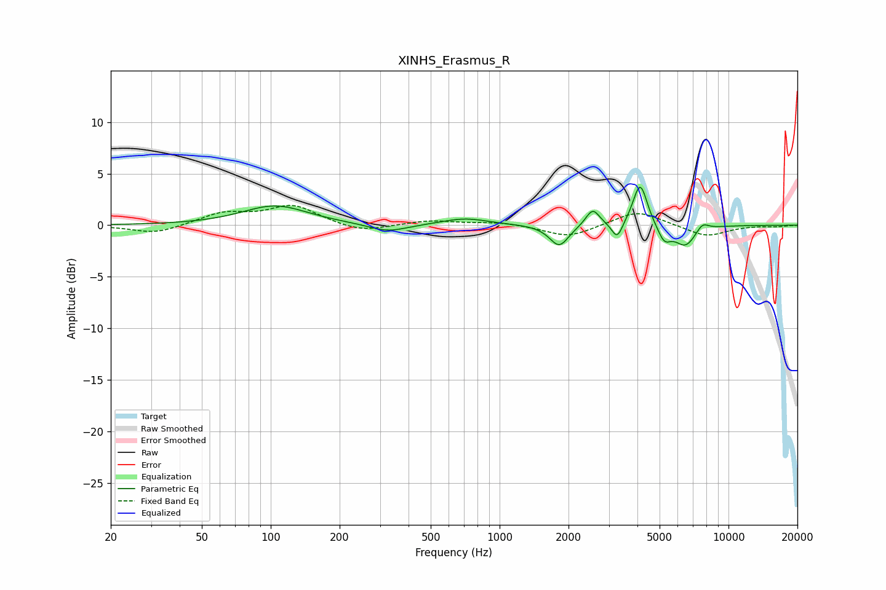

# XINHS_Erasmus_R
See [usage instructions](https://github.com/jaakkopasanen/AutoEq#usage) for more options and info.

### Parametric EQs
Apply preamp of -3.8 dB when using parametric equalizer.

|   # | Type    |   Fc (Hz) |    Q |   Gain (dB) |
|-----|---------|-----------|------|-------------|
|   1 | Peaking |       104 | 0.99 |         1.9 |
|   2 | Peaking |       325 | 1.67 |        -0.8 |
|   3 | Peaking |       706 | 1.4  |         0.7 |
|   4 | Peaking |      1821 | 3.38 |        -2.1 |
|   5 | Peaking |      2551 | 4.68 |         1.7 |
|   6 | Peaking |      3264 | 5.99 |        -1.7 |
|   7 | Peaking |      4112 | 4.52 |         4.2 |
|   8 | Peaking |      5238 | 4.81 |        -1.5 |
|   9 | Peaking |      6480 | 2.89 |        -2   |
|  10 | Peaking |      7691 | 5    |         0.8 |

### Fixed Band EQs
When using fixed band (also called graphic) equalizer, apply preamp of **-2.0 dB** (if available) and set gains manually with these parameters.

|   # | Type    |   Fc (Hz) |    Q |   Gain (dB) |
|-----|---------|-----------|------|-------------|
|   1 | Peaking |        31 | 1.41 |        -0.9 |
|   2 | Peaking |        62 | 1.41 |         1.1 |
|   3 | Peaking |       125 | 1.41 |         1.8 |
|   4 | Peaking |       250 | 1.41 |        -0.7 |
|   5 | Peaking |       500 | 1.41 |         0.4 |
|   6 | Peaking |      1000 | 1.41 |         0.3 |
|   7 | Peaking |      2000 | 1.41 |        -1.2 |
|   8 | Peaking |      4000 | 1.41 |         1.5 |
|   9 | Peaking |      8000 | 1.41 |        -1.1 |
|  10 | Peaking |     16000 | 1.41 |        -0.1 |

### Graphs

