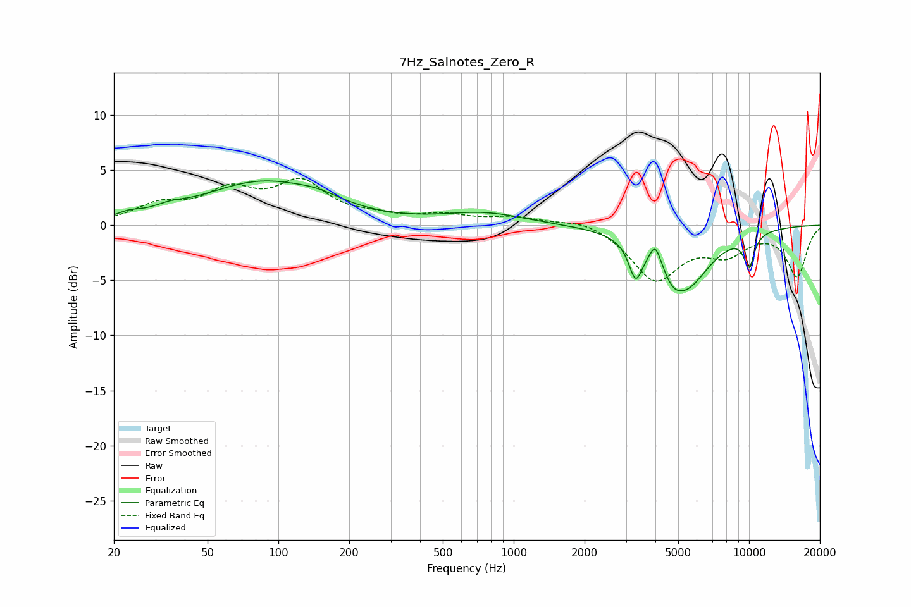

# 7Hz_Salnotes_Zero_R
See [usage instructions](https://github.com/jaakkopasanen/AutoEq#usage) for more options and info.

### Parametric EQs
Apply preamp of -4.1 dB when using parametric equalizer.

|   # | Type    |   Fc (Hz) |    Q |   Gain (dB) |
|-----|---------|-----------|------|-------------|
|   1 | Peaking |        23 | 2.89 |         0.4 |
|   2 | Peaking |        34 | 2.14 |         0.5 |
|   3 | Peaking |        84 | 0.57 |         3.8 |
|   4 | Peaking |       148 | 1.46 |         0.6 |
|   5 | Peaking |       750 | 0.82 |         1.1 |
|   6 | Peaking |      3296 | 5.01 |        -3.2 |
|   7 | Peaking |      3998 | 5.95 |         2   |
|   8 | Peaking |      4753 | 4.28 |        -0.7 |
|   9 | Peaking |      5300 | 1.3  |        -5.6 |
|  10 | Peaking |     10000 | 5.48 |        -2.9 |

### Fixed Band EQs
When using fixed band (also called graphic) equalizer, apply preamp of **-4.3 dB** (if available) and set gains manually with these parameters.

|   # | Type    |   Fc (Hz) |    Q |   Gain (dB) |
|-----|---------|-----------|------|-------------|
|   1 | Peaking |        31 | 1.41 |         1.6 |
|   2 | Peaking |        62 | 1.41 |         2.7 |
|   3 | Peaking |       125 | 1.41 |         3.5 |
|   4 | Peaking |       250 | 1.41 |         0.5 |
|   5 | Peaking |       500 | 1.41 |         0.8 |
|   6 | Peaking |      1000 | 1.41 |         0.7 |
|   7 | Peaking |      2000 | 1.41 |         0.7 |
|   8 | Peaking |      4000 | 1.41 |        -4.9 |
|   9 | Peaking |      8000 | 1.41 |        -2.2 |
|  10 | Peaking |     16000 | 1.41 |        -4.6 |

### Graphs

