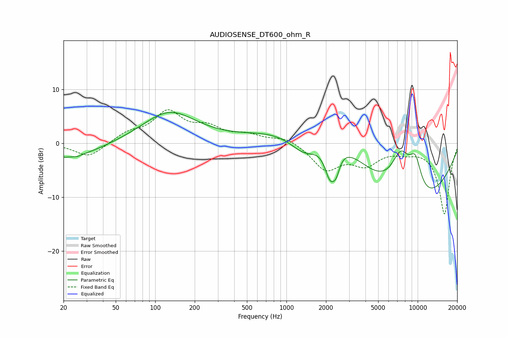

# AUDIOSENSE_DT600_ohm_R
See [usage instructions](https://github.com/jaakkopasanen/AutoEq#usage) for more options and info.

### Parametric EQs
Apply preamp of -5.8 dB when using parametric equalizer.

|   # | Type    |   Fc (Hz) |    Q |   Gain (dB) |
|-----|---------|-----------|------|-------------|
|   1 | Peaking |        21 | 0.58 |        -2.9 |
|   2 | Peaking |        25 | 5.6  |        -0.2 |
|   3 | Peaking |       128 | 0.68 |         5.8 |
|   4 | Peaking |      1407 | 1.02 |        -6.8 |
|   5 | Peaking |      1936 | 0.47 |        10.2 |
|   6 | Peaking |      2158 | 3.11 |        -6.7 |
|   7 | Peaking |      2398 | 5.49 |        -2.4 |
|   8 | Peaking |      7467 | 1.46 |        10.7 |
|   9 | Peaking |      7802 | 0.35 |       -15.9 |
|  10 | Peaking |      9589 | 2.59 |         6.1 |

### Fixed Band EQs
When using fixed band (also called graphic) equalizer, apply preamp of **-6.3 dB** (if available) and set gains manually with these parameters.

|   # | Type    |   Fc (Hz) |    Q |   Gain (dB) |
|-----|---------|-----------|------|-------------|
|   1 | Peaking |        31 | 1.41 |        -2.7 |
|   2 | Peaking |        62 | 1.41 |         1.7 |
|   3 | Peaking |       125 | 1.41 |         5.5 |
|   4 | Peaking |       250 | 1.41 |         2.5 |
|   5 | Peaking |       500 | 1.41 |         1.3 |
|   6 | Peaking |      1000 | 1.41 |         1.2 |
|   7 | Peaking |      2000 | 1.41 |        -4.7 |
|   8 | Peaking |      4000 | 1.41 |        -3.5 |
|   9 | Peaking |      8000 | 1.41 |        -1   |
|  10 | Peaking |     16000 | 1.41 |       -13.1 |

### Graphs

