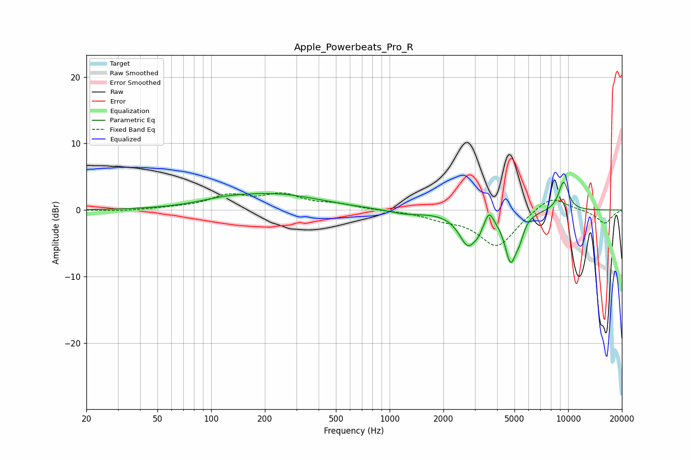

# Apple_Powerbeats_Pro_R
See [usage instructions](https://github.com/jaakkopasanen/AutoEq#usage) for more options and info.

### Parametric EQs
Apply preamp of -4.3 dB when using parametric equalizer.

|   # | Type    |   Fc (Hz) |    Q |   Gain (dB) |
|-----|---------|-----------|------|-------------|
|   1 | Peaking |       116 | 0.99 |         0.7 |
|   2 | Peaking |       230 | 0.55 |         2.2 |
|   3 | Peaking |      1234 | 1.45 |        -0.6 |
|   4 | Peaking |      2765 | 2.72 |        -5.1 |
|   5 | Peaking |      2897 | 5.65 |         0.2 |
|   6 | Peaking |      3151 | 5.97 |        -0.8 |
|   7 | Peaking |      3602 | 5.99 |         2.1 |
|   8 | Peaking |      4763 | 4.22 |        -7.1 |
|   9 | Peaking |      5347 | 6    |        -1.9 |
|  10 | Peaking |      9424 | 4.39 |         4.4 |

### Fixed Band EQs
When using fixed band (also called graphic) equalizer, apply preamp of **-2.7 dB** (if available) and set gains manually with these parameters.

|   # | Type    |   Fc (Hz) |    Q |   Gain (dB) |
|-----|---------|-----------|------|-------------|
|   1 | Peaking |        31 | 1.41 |        -0.2 |
|   2 | Peaking |        62 | 1.41 |         0.3 |
|   3 | Peaking |       125 | 1.41 |         2   |
|   4 | Peaking |       250 | 1.41 |         2.1 |
|   5 | Peaking |       500 | 1.41 |         0.8 |
|   6 | Peaking |      1000 | 1.41 |        -0.1 |
|   7 | Peaking |      2000 | 1.41 |        -1   |
|   8 | Peaking |      4000 | 1.41 |        -5.5 |
|   9 | Peaking |      8000 | 1.41 |         2.4 |
|  10 | Peaking |     16000 | 1.41 |        -2   |

### Graphs

