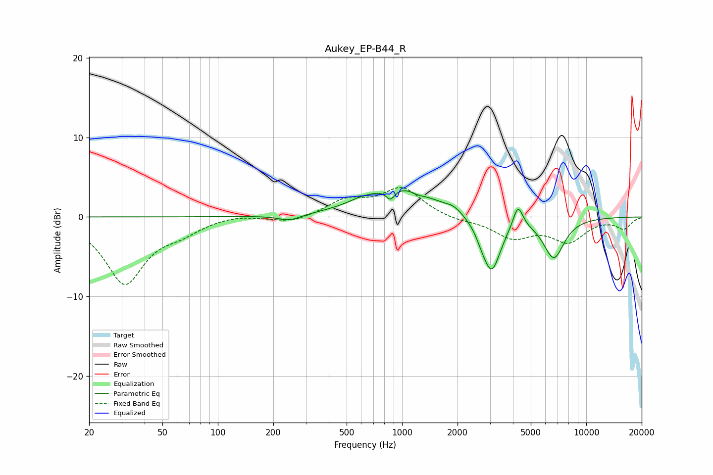

# Aukey_EP-B44_R
See [usage instructions](https://github.com/jaakkopasanen/AutoEq#usage) for more options and info.

### Parametric EQs
Apply preamp of -3.4 dB when using parametric equalizer.

|   # | Type    |   Fc (Hz) |    Q |   Gain (dB) |
|-----|---------|-----------|------|-------------|
|   1 | Peaking |       245 | 2.31 |        -0.8 |
|   2 | Peaking |       594 | 2.1  |         0.4 |
|   3 | Peaking |       865 | 6    |        -1.4 |
|   4 | Peaking |       980 | 0.77 |         3.8 |
|   5 | Peaking |      1224 | 3.78 |        -0.4 |
|   6 | Peaking |      1914 | 3.3  |         0.6 |
|   7 | Peaking |      2694 | 5.16 |        -0.6 |
|   8 | Peaking |      3059 | 2.76 |        -7   |
|   9 | Peaking |      4259 | 5.27 |         2.9 |
|  10 | Peaking |      6664 | 2.38 |        -5.1 |

### Fixed Band EQs
When using fixed band (also called graphic) equalizer, apply preamp of **-3.8 dB** (if available) and set gains manually with these parameters.

|   # | Type    |   Fc (Hz) |    Q |   Gain (dB) |
|-----|---------|-----------|------|-------------|
|   1 | Peaking |        31 | 1.41 |        -8.3 |
|   2 | Peaking |        62 | 1.41 |        -1.4 |
|   3 | Peaking |       125 | 1.41 |         0.4 |
|   4 | Peaking |       250 | 1.41 |        -0.8 |
|   5 | Peaking |       500 | 1.41 |         2   |
|   6 | Peaking |      1000 | 1.41 |         3.5 |
|   7 | Peaking |      2000 | 1.41 |        -0.5 |
|   8 | Peaking |      4000 | 1.41 |        -2.5 |
|   9 | Peaking |      8000 | 1.41 |        -2.9 |
|  10 | Peaking |     16000 | 1.41 |        -1.4 |

### Graphs

