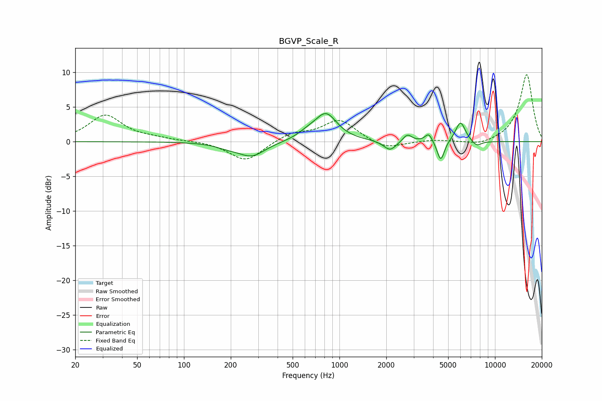

# BGVP_Scale_R
See [usage instructions](https://github.com/jaakkopasanen/AutoEq#usage) for more options and info.

### Parametric EQs
Apply preamp of -4.1 dB when using parametric equalizer.

|   # | Type    |   Fc (Hz) |    Q |   Gain (dB) |
|-----|---------|-----------|------|-------------|
|   1 | Peaking |       190 | 1.86 |        -0.5 |
|   2 | Peaking |       273 | 1.64 |        -2.1 |
|   3 | Peaking |       623 | 2.18 |         0.7 |
|   4 | Peaking |       819 | 1.99 |         3.9 |
|   5 | Peaking |      2115 | 3.47 |        -1.4 |
|   6 | Peaking |      2734 | 4.88 |         1.1 |
|   7 | Peaking |      3750 | 6    |         1.3 |
|   8 | Peaking |      4481 | 6    |        -3   |
|   9 | Peaking |      6000 | 4.33 |         2.9 |
|  10 | Peaking |      7624 | 4.18 |        -0.8 |

### Fixed Band EQs
When using fixed band (also called graphic) equalizer, apply preamp of **-9.8 dB** (if available) and set gains manually with these parameters.

|   # | Type    |   Fc (Hz) |    Q |   Gain (dB) |
|-----|---------|-----------|------|-------------|
|   1 | Peaking |        31 | 1.41 |         3.8 |
|   2 | Peaking |        62 | 1.41 |         0.3 |
|   3 | Peaking |       125 | 1.41 |         0.1 |
|   4 | Peaking |       250 | 1.41 |        -2.9 |
|   5 | Peaking |       500 | 1.41 |         1.2 |
|   6 | Peaking |      1000 | 1.41 |         3.1 |
|   7 | Peaking |      2000 | 1.41 |        -1.2 |
|   8 | Peaking |      4000 | 1.41 |         0.2 |
|   9 | Peaking |      8000 | 1.41 |        -0.6 |
|  10 | Peaking |     16000 | 1.41 |         9.8 |

### Graphs

