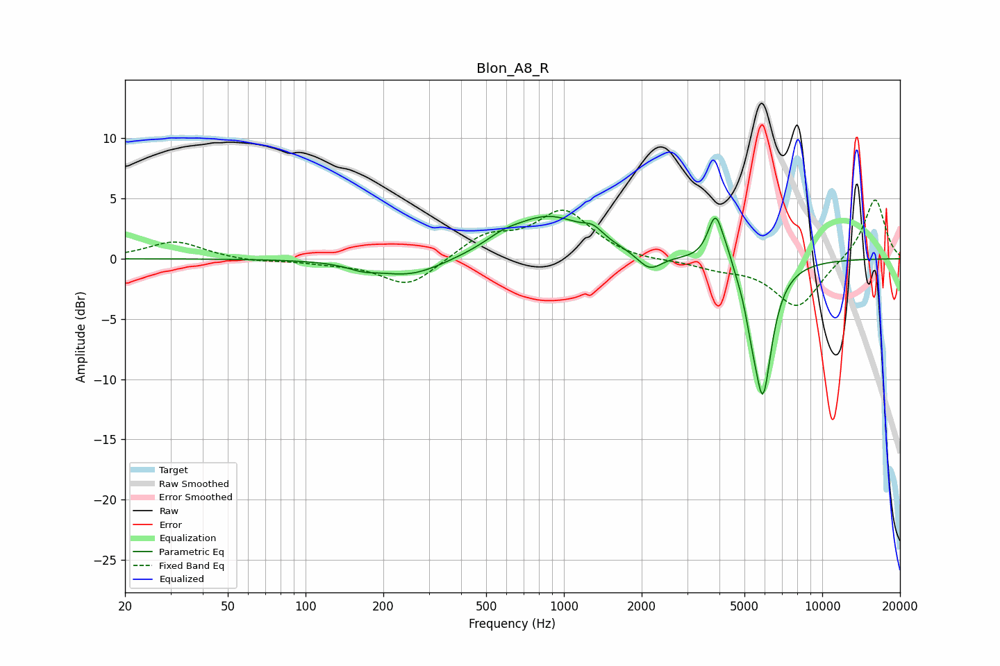

# Blon_A8_R
See [usage instructions](https://github.com/jaakkopasanen/AutoEq#usage) for more options and info.

### Parametric EQs
Apply preamp of -3.6 dB when using parametric equalizer.

|   # | Type    |   Fc (Hz) |    Q |   Gain (dB) |
|-----|---------|-----------|------|-------------|
|   1 | Peaking |       166 | 2.56 |        -0.4 |
|   2 | Peaking |       254 | 1.03 |        -1.6 |
|   3 | Peaking |       578 | 2.15 |         0.6 |
|   4 | Peaking |       872 | 0.93 |         3.5 |
|   5 | Peaking |      1297 | 3.77 |         0.8 |
|   6 | Peaking |      2145 | 2.97 |        -1.4 |
|   7 | Peaking |      3865 | 4.68 |         4.1 |
|   8 | Peaking |      4293 | 6    |         0.7 |
|   9 | Peaking |      5316 | 5.99 |        -1.5 |
|  10 | Peaking |      5888 | 3.76 |       -11   |

### Fixed Band EQs
When using fixed band (also called graphic) equalizer, apply preamp of **-5.0 dB** (if available) and set gains manually with these parameters.

|   # | Type    |   Fc (Hz) |    Q |   Gain (dB) |
|-----|---------|-----------|------|-------------|
|   1 | Peaking |        31 | 1.41 |         1.5 |
|   2 | Peaking |        62 | 1.41 |        -0.2 |
|   3 | Peaking |       125 | 1.41 |        -0.3 |
|   4 | Peaking |       250 | 1.41 |        -2.4 |
|   5 | Peaking |       500 | 1.41 |         1.8 |
|   6 | Peaking |      1000 | 1.41 |         3.9 |
|   7 | Peaking |      2000 | 1.41 |        -0.2 |
|   8 | Peaking |      4000 | 1.41 |        -0.7 |
|   9 | Peaking |      8000 | 1.41 |        -4.1 |
|  10 | Peaking |     16000 | 1.41 |         5.1 |

### Graphs

