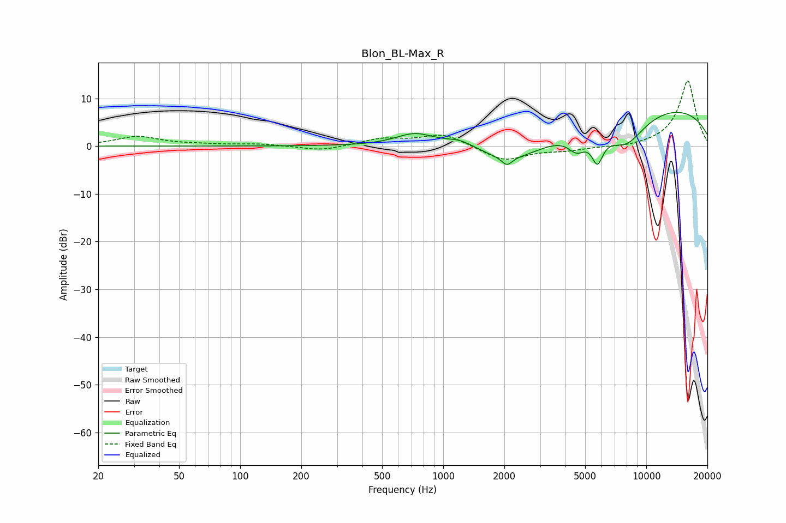

# Blon_BL-Max_R
See [usage instructions](https://github.com/jaakkopasanen/AutoEq#usage) for more options and info.

### Parametric EQs
Apply preamp of -7.2 dB when using parametric equalizer.

|   # | Type    |   Fc (Hz) |    Q |   Gain (dB) |
|-----|---------|-----------|------|-------------|
|   1 | Peaking |       729 | 1.45 |         2.7 |
|   2 | Peaking |      1211 | 1.99 |         1.5 |
|   3 | Peaking |      1944 | 2.34 |        -0.3 |
|   4 | Peaking |      2062 | 5.68 |        -1.7 |
|   5 | Peaking |      2323 | 0.73 |        -5.6 |
|   6 | Peaking |      3954 | 5.57 |         0.1 |
|   7 | Peaking |      4547 | 3.08 |        -3.5 |
|   8 | Peaking |      5746 | 4.82 |        -5.7 |
|   9 | Peaking |      7910 | 1.27 |        -6.9 |
|  10 | Peaking |     10000 | 0.22 |         8.9 |

### Fixed Band EQs
When using fixed band (also called graphic) equalizer, apply preamp of **-13.7 dB** (if available) and set gains manually with these parameters.

|   # | Type    |   Fc (Hz) |    Q |   Gain (dB) |
|-----|---------|-----------|------|-------------|
|   1 | Peaking |        31 | 1.41 |         2   |
|   2 | Peaking |        62 | 1.41 |         0.3 |
|   3 | Peaking |       125 | 1.41 |         0.4 |
|   4 | Peaking |       250 | 1.41 |        -1   |
|   5 | Peaking |       500 | 1.41 |         1.5 |
|   6 | Peaking |      1000 | 1.41 |         2.6 |
|   7 | Peaking |      2000 | 1.41 |        -3.1 |
|   8 | Peaking |      4000 | 1.41 |        -0.8 |
|   9 | Peaking |      8000 | 1.41 |        -0.4 |
|  10 | Peaking |     16000 | 1.41 |        13.8 |

### Graphs

