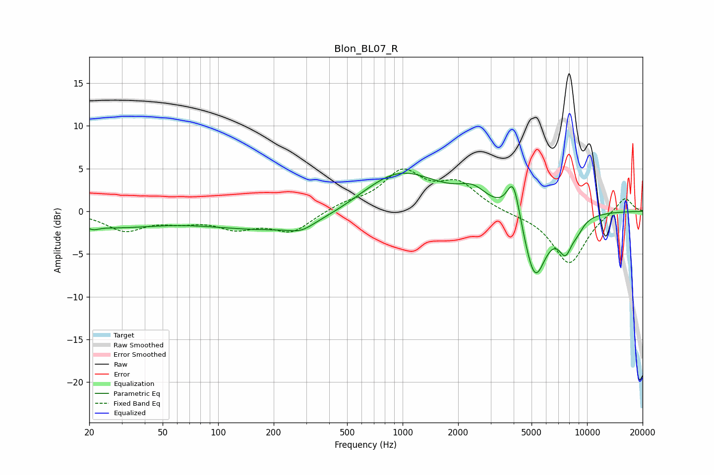

# Blon_BL07_R
See [usage instructions](https://github.com/jaakkopasanen/AutoEq#usage) for more options and info.

### Parametric EQs
Apply preamp of -4.6 dB when using parametric equalizer.

|   # | Type    |   Fc (Hz) |    Q |   Gain (dB) |
|-----|---------|-----------|------|-------------|
|   1 | Peaking |        21 | 4.57 |        -0.4 |
|   2 | Peaking |        26 | 0.54 |        -1.7 |
|   3 | Peaking |       264 | 0.32 |        -2.6 |
|   4 | Peaking |       281 | 2.14 |        -0.8 |
|   5 | Peaking |       938 | 0.63 |         5.6 |
|   6 | Peaking |      2408 | 1.84 |         1.8 |
|   7 | Peaking |      3988 | 3.83 |         5   |
|   8 | Peaking |      5207 | 2.2  |        -8.2 |
|   9 | Peaking |      7634 | 3.47 |        -3.4 |
|  10 | Peaking |      8857 | 3.53 |        -1   |

### Fixed Band EQs
When using fixed band (also called graphic) equalizer, apply preamp of **-5.1 dB** (if available) and set gains manually with these parameters.

|   # | Type    |   Fc (Hz) |    Q |   Gain (dB) |
|-----|---------|-----------|------|-------------|
|   1 | Peaking |        31 | 1.41 |        -2.1 |
|   2 | Peaking |        62 | 1.41 |        -0.9 |
|   3 | Peaking |       125 | 1.41 |        -1.7 |
|   4 | Peaking |       250 | 1.41 |        -2.3 |
|   5 | Peaking |       500 | 1.41 |         0.8 |
|   6 | Peaking |      1000 | 1.41 |         4.4 |
|   7 | Peaking |      2000 | 1.41 |         3   |
|   8 | Peaking |      4000 | 1.41 |        -0.2 |
|   9 | Peaking |      8000 | 1.41 |        -6.2 |
|  10 | Peaking |     16000 | 1.41 |         1.8 |

### Graphs

