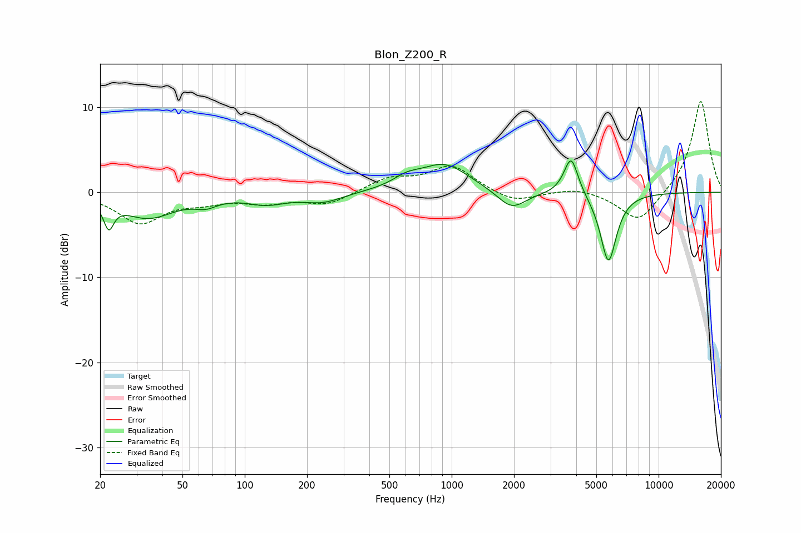

# Blon_Z200_R
See [usage instructions](https://github.com/jaakkopasanen/AutoEq#usage) for more options and info.

### Parametric EQs
Apply preamp of -3.8 dB when using parametric equalizer.

|   # | Type    |   Fc (Hz) |    Q |   Gain (dB) |
|-----|---------|-----------|------|-------------|
|   1 | Peaking |        22 | 5.97 |        -3   |
|   2 | Peaking |        34 | 1.11 |        -2.9 |
|   3 | Peaking |        65 | 2.56 |        -0.9 |
|   4 | Peaking |       127 | 1.47 |        -1.1 |
|   5 | Peaking |       240 | 1.47 |        -1.1 |
|   6 | Peaking |       604 | 2.13 |         1   |
|   7 | Peaking |       922 | 1.18 |         3.3 |
|   8 | Peaking |      1949 | 2.04 |        -2.3 |
|   9 | Peaking |      3776 | 4.13 |         4.6 |
|  10 | Peaking |      5721 | 3.52 |        -8.3 |

### Fixed Band EQs
When using fixed band (also called graphic) equalizer, apply preamp of **-10.8 dB** (if available) and set gains manually with these parameters.

|   # | Type    |   Fc (Hz) |    Q |   Gain (dB) |
|-----|---------|-----------|------|-------------|
|   1 | Peaking |        31 | 1.41 |        -3.5 |
|   2 | Peaking |        62 | 1.41 |        -0.9 |
|   3 | Peaking |       125 | 1.41 |        -1.1 |
|   4 | Peaking |       250 | 1.41 |        -1.4 |
|   5 | Peaking |       500 | 1.41 |         1.6 |
|   6 | Peaking |      1000 | 1.41 |         3.1 |
|   7 | Peaking |      2000 | 1.41 |        -1.3 |
|   8 | Peaking |      4000 | 1.41 |         0.6 |
|   9 | Peaking |      8000 | 1.41 |        -3.7 |
|  10 | Peaking |     16000 | 1.41 |        10.9 |

### Graphs

