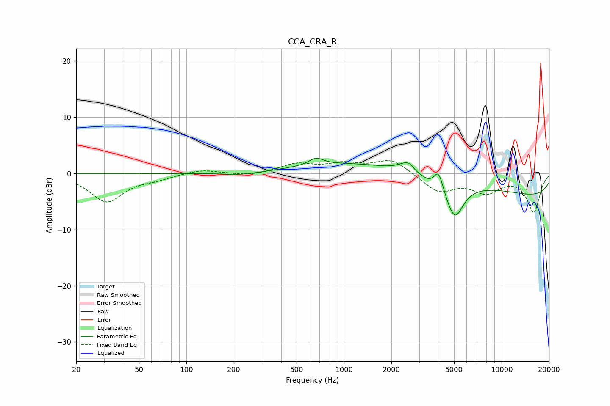

# CCA_CRA_R
See [usage instructions](https://github.com/jaakkopasanen/AutoEq#usage) for more options and info.

### Parametric EQs
Apply preamp of -2.8 dB when using parametric equalizer.

|   # | Type    |   Fc (Hz) |    Q |   Gain (dB) |
|-----|---------|-----------|------|-------------|
|   1 | Peaking |       226 | 1.15 |        -0.5 |
|   2 | Peaking |       665 | 3.18 |         1.3 |
|   3 | Peaking |      2612 | 2.42 |         2.5 |
|   4 | Peaking |      2844 | 5.99 |        -0.5 |
|   5 | Peaking |      3120 | 0.19 |         3.3 |
|   6 | Peaking |      3506 | 1.78 |        -1.1 |
|   7 | Peaking |      3983 | 4.77 |         3.6 |
|   8 | Peaking |      4957 | 4.08 |         0.7 |
|   9 | Peaking |      5024 | 2.63 |        -7   |
|  10 | Peaking |     10000 | 0.18 |        -5.1 |

### Fixed Band EQs
When using fixed band (also called graphic) equalizer, apply preamp of **-2.4 dB** (if available) and set gains manually with these parameters.

|   # | Type    |   Fc (Hz) |    Q |   Gain (dB) |
|-----|---------|-----------|------|-------------|
|   1 | Peaking |        31 | 1.41 |        -5   |
|   2 | Peaking |        62 | 1.41 |        -0.8 |
|   3 | Peaking |       125 | 1.41 |         0.8 |
|   4 | Peaking |       250 | 1.41 |        -0.5 |
|   5 | Peaking |       500 | 1.41 |         1.6 |
|   6 | Peaking |      1000 | 1.41 |         1.5 |
|   7 | Peaking |      2000 | 1.41 |         2.5 |
|   8 | Peaking |      4000 | 1.41 |        -3.2 |
|   9 | Peaking |      8000 | 1.41 |        -3   |
|  10 | Peaking |     16000 | 1.41 |        -6.8 |

### Graphs

