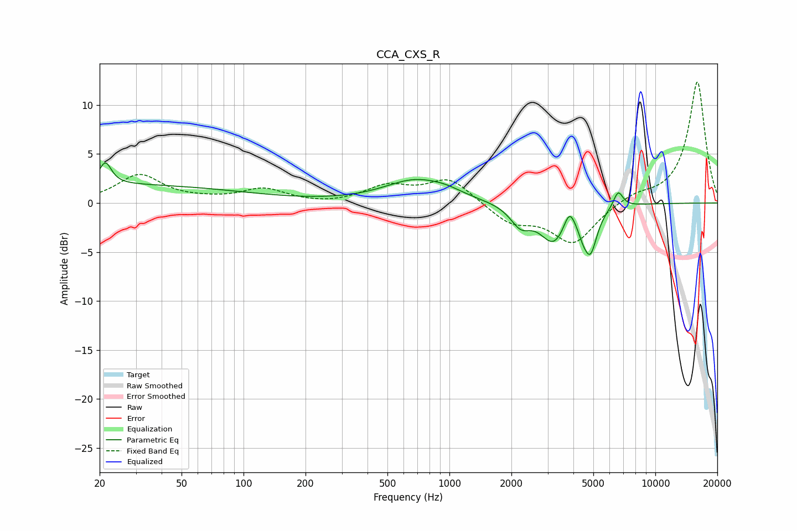

# CCA_CXS_R
See [usage instructions](https://github.com/jaakkopasanen/AutoEq#usage) for more options and info.

### Parametric EQs
Apply preamp of -4.2 dB when using parametric equalizer.

|   # | Type    |   Fc (Hz) |    Q |   Gain (dB) |
|-----|---------|-----------|------|-------------|
|   1 | Peaking |        20 | 0.18 |         1.9 |
|   2 | Peaking |        21 | 5.04 |         2.2 |
|   3 | Peaking |       685 | 0.93 |         2.3 |
|   4 | Peaking |       968 | 1.88 |         0.4 |
|   5 | Peaking |      2217 | 2.84 |        -2   |
|   6 | Peaking |      3207 | 2.12 |        -3.8 |
|   7 | Peaking |      3825 | 5.22 |         2   |
|   8 | Peaking |      4441 | 5.89 |        -1   |
|   9 | Peaking |      4838 | 4.32 |        -4.2 |
|  10 | Peaking |      6601 | 5.91 |         1.7 |

### Fixed Band EQs
When using fixed band (also called graphic) equalizer, apply preamp of **-12.4 dB** (if available) and set gains manually with these parameters.

|   # | Type    |   Fc (Hz) |    Q |   Gain (dB) |
|-----|---------|-----------|------|-------------|
|   1 | Peaking |        31 | 1.41 |         2.8 |
|   2 | Peaking |        62 | 1.41 |         0.2 |
|   3 | Peaking |       125 | 1.41 |         1.4 |
|   4 | Peaking |       250 | 1.41 |        -0.2 |
|   5 | Peaking |       500 | 1.41 |         1.6 |
|   6 | Peaking |      1000 | 1.41 |         2.5 |
|   7 | Peaking |      2000 | 1.41 |        -2   |
|   8 | Peaking |      4000 | 1.41 |        -4.1 |
|   9 | Peaking |      8000 | 1.41 |         0.8 |
|  10 | Peaking |     16000 | 1.41 |        12.4 |

### Graphs

