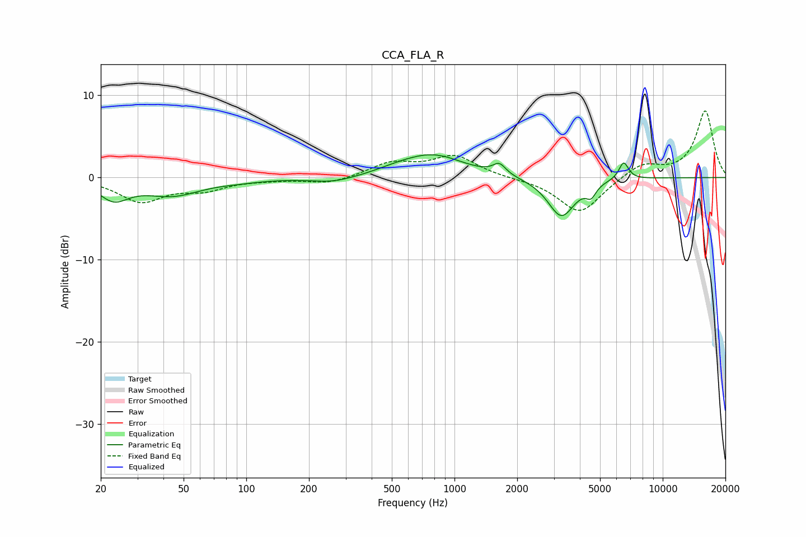

# CCA_FLA_R
See [usage instructions](https://github.com/jaakkopasanen/AutoEq#usage) for more options and info.

### Parametric EQs
Apply preamp of -2.9 dB when using parametric equalizer.

|   # | Type    |   Fc (Hz) |    Q |   Gain (dB) |
|-----|---------|-----------|------|-------------|
|   1 | Peaking |        23 | 2.03 |        -2.3 |
|   2 | Peaking |        44 | 1.03 |        -2   |
|   3 | Peaking |        93 | 1.28 |        -0.3 |
|   4 | Peaking |       263 | 1.3  |        -0.7 |
|   5 | Peaking |       533 | 1.4  |         0.4 |
|   6 | Peaking |       789 | 0.96 |         2.7 |
|   7 | Peaking |      1642 | 4.52 |         1.3 |
|   8 | Peaking |      3260 | 2.17 |        -4.8 |
|   9 | Peaking |      4529 | 5.99 |        -1.4 |
|  10 | Peaking |      6492 | 5.91 |         2.1 |

### Fixed Band EQs
When using fixed band (also called graphic) equalizer, apply preamp of **-8.2 dB** (if available) and set gains manually with these parameters.

|   # | Type    |   Fc (Hz) |    Q |   Gain (dB) |
|-----|---------|-----------|------|-------------|
|   1 | Peaking |        31 | 1.41 |        -2.8 |
|   2 | Peaking |        62 | 1.41 |        -1.3 |
|   3 | Peaking |       125 | 1.41 |        -0.2 |
|   4 | Peaking |       250 | 1.41 |        -0.8 |
|   5 | Peaking |       500 | 1.41 |         1.7 |
|   6 | Peaking |      1000 | 1.41 |         2.5 |
|   7 | Peaking |      2000 | 1.41 |        -0.1 |
|   8 | Peaking |      4000 | 1.41 |        -4.4 |
|   9 | Peaking |      8000 | 1.41 |         1.7 |
|  10 | Peaking |     16000 | 1.41 |         8.1 |

### Graphs

