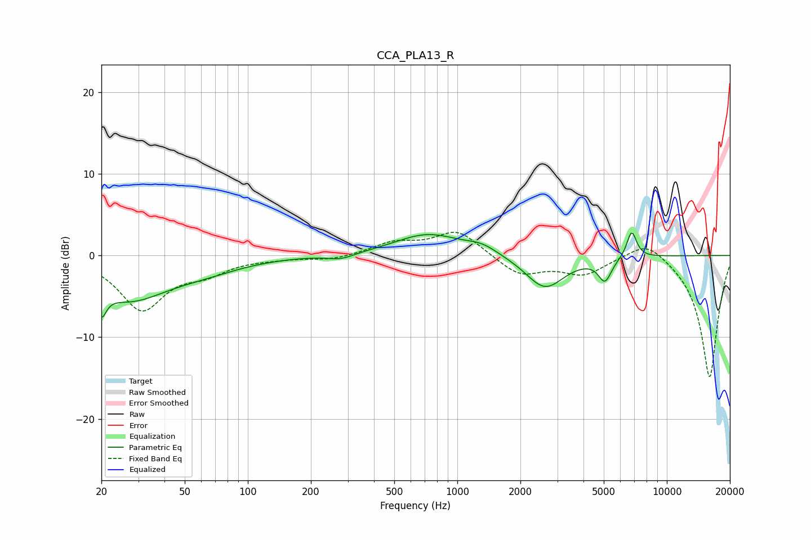

# CCA_PLA13_R
See [usage instructions](https://github.com/jaakkopasanen/AutoEq#usage) for more options and info.

### Parametric EQs
Apply preamp of -2.8 dB when using parametric equalizer.

|   # | Type    |   Fc (Hz) |    Q |   Gain (dB) |
|-----|---------|-----------|------|-------------|
|   1 | Peaking |        20 | 5.95 |        -6.3 |
|   2 | Peaking |        20 | 5.96 |         3.1 |
|   3 | Peaking |        27 | 0.77 |        -5   |
|   4 | Peaking |        61 | 0.75 |        -1.3 |
|   5 | Peaking |       278 | 2.18 |        -0.7 |
|   6 | Peaking |       725 | 0.89 |         2.6 |
|   7 | Peaking |      1310 | 1.89 |         0.9 |
|   8 | Peaking |      2620 | 1.53 |        -4.1 |
|   9 | Peaking |      5065 | 4.45 |        -2.8 |
|  10 | Peaking |      6795 | 5.8  |         3.3 |

### Fixed Band EQs
When using fixed band (also called graphic) equalizer, apply preamp of **-2.9 dB** (if available) and set gains manually with these parameters.

|   # | Type    |   Fc (Hz) |    Q |   Gain (dB) |
|-----|---------|-----------|------|-------------|
|   1 | Peaking |        31 | 1.41 |        -6.5 |
|   2 | Peaking |        62 | 1.41 |        -1.7 |
|   3 | Peaking |       125 | 1.41 |        -0.2 |
|   4 | Peaking |       250 | 1.41 |        -0.5 |
|   5 | Peaking |       500 | 1.41 |         1.5 |
|   6 | Peaking |      1000 | 1.41 |         3.1 |
|   7 | Peaking |      2000 | 1.41 |        -2.4 |
|   8 | Peaking |      4000 | 1.41 |        -2.2 |
|   9 | Peaking |      8000 | 1.41 |         2.2 |
|  10 | Peaking |     16000 | 1.41 |       -15   |

### Graphs

