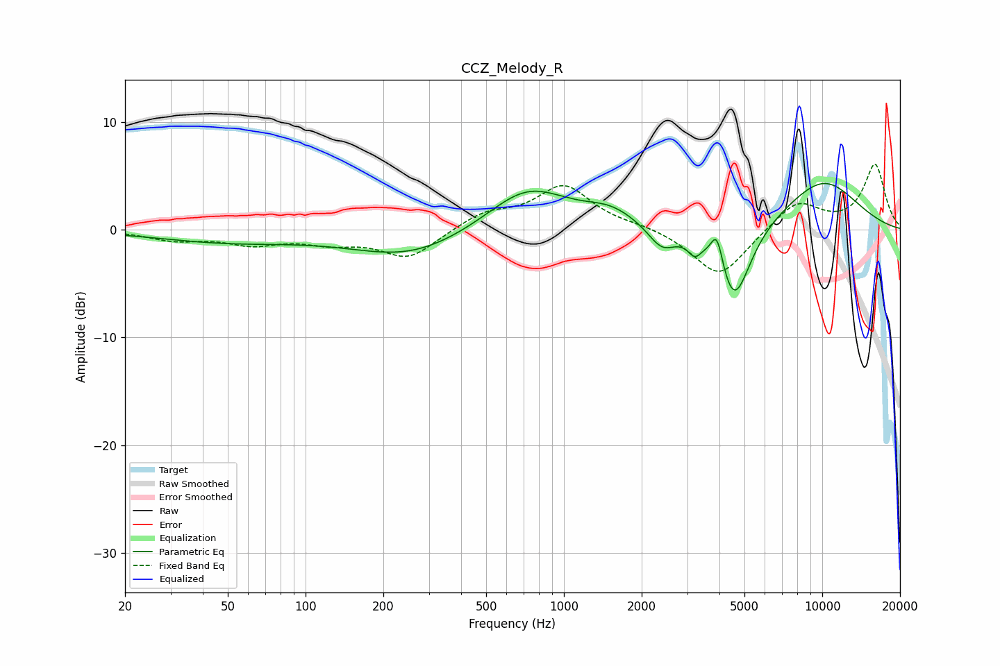

# CCZ_Melody_R
See [usage instructions](https://github.com/jaakkopasanen/AutoEq#usage) for more options and info.

### Parametric EQs
Apply preamp of -4.4 dB when using parametric equalizer.

|   # | Type    |   Fc (Hz) |    Q |   Gain (dB) |
|-----|---------|-----------|------|-------------|
|   1 | Peaking |        50 | 0.52 |        -1.1 |
|   2 | Peaking |       253 | 0.67 |        -2.1 |
|   3 | Peaking |       288 | 0.4  |        -0.4 |
|   4 | Peaking |       723 | 0.9  |         4.1 |
|   5 | Peaking |      1518 | 1.39 |         1.4 |
|   6 | Peaking |      2396 | 2.63 |        -2   |
|   7 | Peaking |      3205 | 5.63 |        -1.3 |
|   8 | Peaking |      3913 | 5.94 |         3.2 |
|   9 | Peaking |      4548 | 2.16 |        -7.4 |
|  10 | Peaking |     10000 | 0.79 |         4.6 |

### Fixed Band EQs
When using fixed band (also called graphic) equalizer, apply preamp of **-6.2 dB** (if available) and set gains manually with these parameters.

|   # | Type    |   Fc (Hz) |    Q |   Gain (dB) |
|-----|---------|-----------|------|-------------|
|   1 | Peaking |        31 | 1.41 |        -0.9 |
|   2 | Peaking |        62 | 1.41 |        -1.2 |
|   3 | Peaking |       125 | 1.41 |        -1   |
|   4 | Peaking |       250 | 1.41 |        -2.6 |
|   5 | Peaking |       500 | 1.41 |         1.5 |
|   6 | Peaking |      1000 | 1.41 |         4   |
|   7 | Peaking |      2000 | 1.41 |         0.3 |
|   8 | Peaking |      4000 | 1.41 |        -4.5 |
|   9 | Peaking |      8000 | 1.41 |         2.7 |
|  10 | Peaking |     16000 | 1.41 |         6   |

### Graphs

