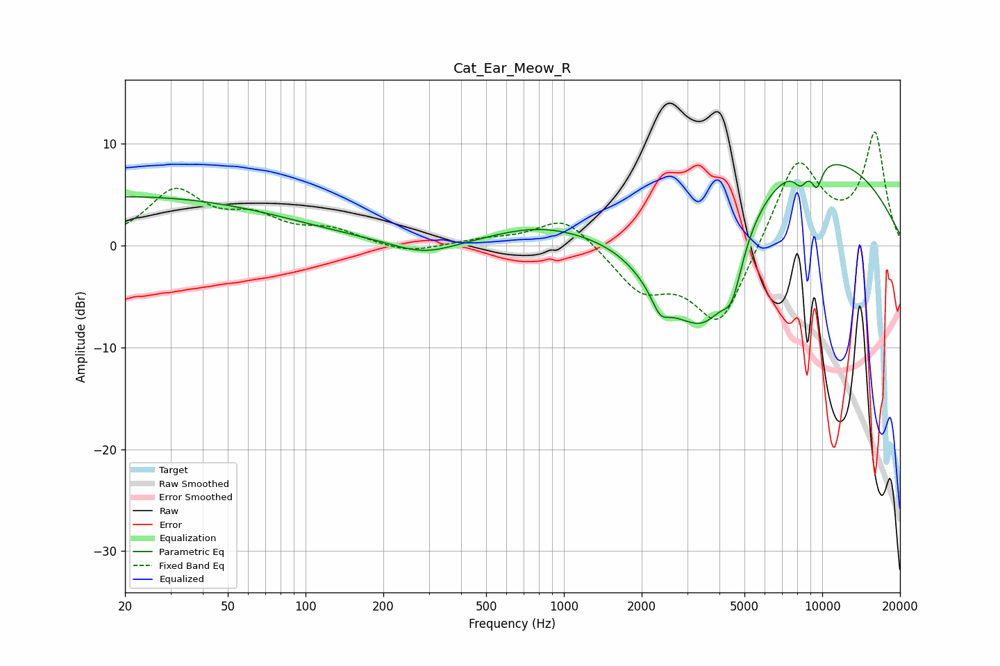

# Cat_Ear_Meow_R
See [usage instructions](https://github.com/jaakkopasanen/AutoEq#usage) for more options and info.

### Parametric EQs
Apply preamp of -8.0 dB when using parametric equalizer.

|   # | Type    |   Fc (Hz) |    Q |   Gain (dB) |
|-----|---------|-----------|------|-------------|
|   1 | Peaking |        20 | 0.21 |         4.8 |
|   2 | Peaking |       288 | 1.15 |        -1.4 |
|   3 | Peaking |       794 | 0.75 |         1.6 |
|   4 | Peaking |      2357 | 4.44 |        -1.7 |
|   5 | Peaking |      2554 | 1.08 |        -5.2 |
|   6 | Peaking |      3568 | 1.11 |       -10.6 |
|   7 | Peaking |      4479 | 3.48 |        -4.2 |
|   8 | Peaking |      7822 | 0.28 |        10.1 |
|   9 | Peaking |      8246 | 5.18 |        -1.6 |
|  10 | Peaking |      9530 | 5.89 |        -2.3 |

### Fixed Band EQs
When using fixed band (also called graphic) equalizer, apply preamp of **-11.2 dB** (if available) and set gains manually with these parameters.

|   # | Type    |   Fc (Hz) |    Q |   Gain (dB) |
|-----|---------|-----------|------|-------------|
|   1 | Peaking |        31 | 1.41 |         5.1 |
|   2 | Peaking |        62 | 1.41 |         2.3 |
|   3 | Peaking |       125 | 1.41 |         1.4 |
|   4 | Peaking |       250 | 1.41 |        -0.8 |
|   5 | Peaking |       500 | 1.41 |         0.5 |
|   6 | Peaking |      1000 | 1.41 |         3   |
|   7 | Peaking |      2000 | 1.41 |        -4.1 |
|   8 | Peaking |      4000 | 1.41 |        -8   |
|   9 | Peaking |      8000 | 1.41 |         8.7 |
|  10 | Peaking |     16000 | 1.41 |        10.8 |

### Graphs

