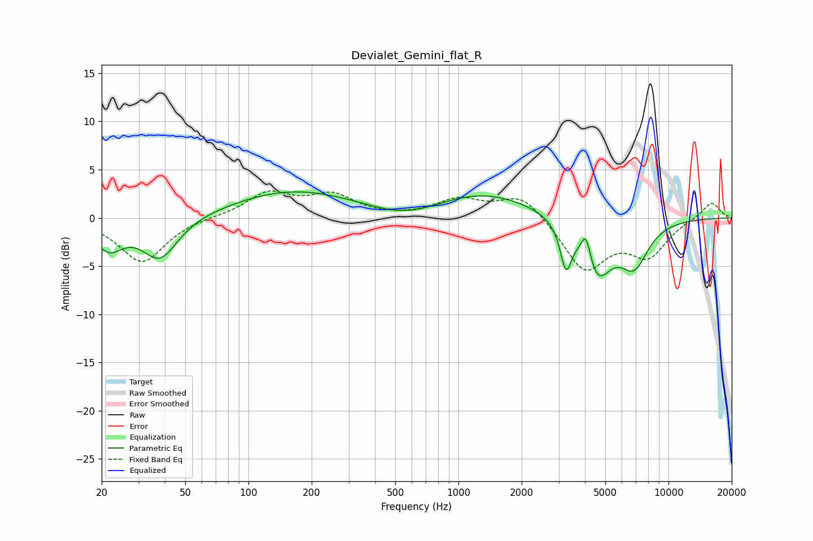

# Devialet_Gemini_flat_R
See [usage instructions](https://github.com/jaakkopasanen/AutoEq#usage) for more options and info.

### Parametric EQs
Apply preamp of -2.8 dB when using parametric equalizer.

|   # | Type    |   Fc (Hz) |    Q |   Gain (dB) |
|-----|---------|-----------|------|-------------|
|   1 | Peaking |        22 | 2.14 |        -2.9 |
|   2 | Peaking |        38 | 1.65 |        -4.4 |
|   3 | Peaking |        75 | 1.11 |        -0.1 |
|   4 | Peaking |       164 | 0.47 |         2.8 |
|   5 | Peaking |       567 | 0.88 |        -1.3 |
|   6 | Peaking |      1304 | 0.57 |         2.6 |
|   7 | Peaking |      3250 | 5.38 |        -4.4 |
|   8 | Peaking |      4051 | 5.98 |         3.1 |
|   9 | Peaking |      4541 | 1.93 |        -6   |
|  10 | Peaking |      6865 | 2    |        -4.3 |

### Fixed Band EQs
When using fixed band (also called graphic) equalizer, apply preamp of **-2.9 dB** (if available) and set gains manually with these parameters.

|   # | Type    |   Fc (Hz) |    Q |   Gain (dB) |
|-----|---------|-----------|------|-------------|
|   1 | Peaking |        31 | 1.41 |        -4.6 |
|   2 | Peaking |        62 | 1.41 |         0.1 |
|   3 | Peaking |       125 | 1.41 |         2.5 |
|   4 | Peaking |       250 | 1.41 |         2.2 |
|   5 | Peaking |       500 | 1.41 |        -0   |
|   6 | Peaking |      1000 | 1.41 |         1.8 |
|   7 | Peaking |      2000 | 1.41 |         2.5 |
|   8 | Peaking |      4000 | 1.41 |        -5.4 |
|   9 | Peaking |      8000 | 1.41 |        -3.6 |
|  10 | Peaking |     16000 | 1.41 |         1.7 |

### Graphs

