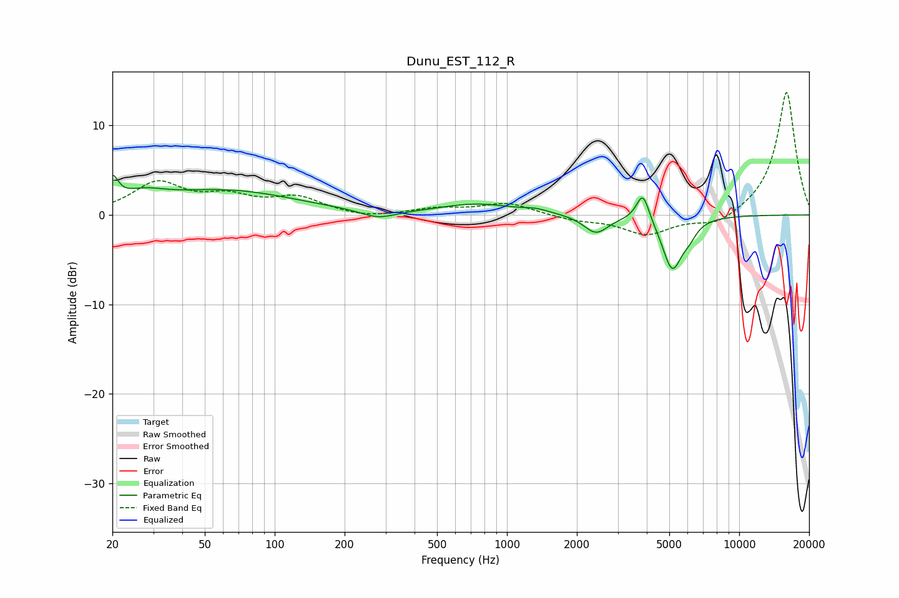

# Dunu_EST_112_R
See [usage instructions](https://github.com/jaakkopasanen/AutoEq#usage) for more options and info.

### Parametric EQs
Apply preamp of -4.5 dB when using parametric equalizer.

|   # | Type    |   Fc (Hz) |    Q |   Gain (dB) |
|-----|---------|-----------|------|-------------|
|   1 | Peaking |        20 | 5.78 |         2.7 |
|   2 | Peaking |        27 | 1.52 |         1.3 |
|   3 | Peaking |        62 | 0.47 |         2.6 |
|   4 | Peaking |       279 | 1.87 |        -0.9 |
|   5 | Peaking |       746 | 0.9  |         1.2 |
|   6 | Peaking |      1336 | 2.61 |         0.4 |
|   7 | Peaking |      2417 | 2.71 |        -2   |
|   8 | Peaking |      3848 | 5.02 |         3.3 |
|   9 | Peaking |      5150 | 3.25 |        -5.9 |
|  10 | Peaking |      6093 | 4.3  |        -1.1 |

### Fixed Band EQs
When using fixed band (also called graphic) equalizer, apply preamp of **-13.8 dB** (if available) and set gains manually with these parameters.

|   # | Type    |   Fc (Hz) |    Q |   Gain (dB) |
|-----|---------|-----------|------|-------------|
|   1 | Peaking |        31 | 1.41 |         3.4 |
|   2 | Peaking |        62 | 1.41 |         1.7 |
|   3 | Peaking |       125 | 1.41 |         1.8 |
|   4 | Peaking |       250 | 1.41 |        -0.4 |
|   5 | Peaking |       500 | 1.41 |         0.7 |
|   6 | Peaking |      1000 | 1.41 |         1.3 |
|   7 | Peaking |      2000 | 1.41 |        -0.6 |
|   8 | Peaking |      4000 | 1.41 |        -2.2 |
|   9 | Peaking |      8000 | 1.41 |        -1.3 |
|  10 | Peaking |     16000 | 1.41 |        13.9 |

### Graphs

