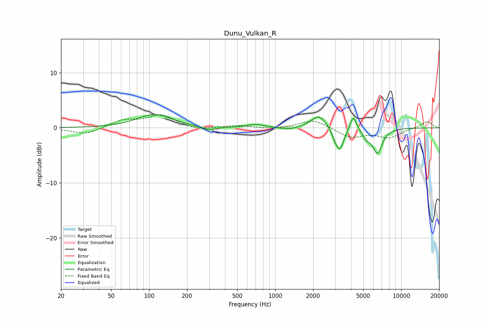

# Dunu_Vulkan_R
See [usage instructions](https://github.com/jaakkopasanen/AutoEq#usage) for more options and info.

### Parametric EQs
Apply preamp of -2.5 dB when using parametric equalizer.

|   # | Type    |   Fc (Hz) |    Q |   Gain (dB) |
|-----|---------|-----------|------|-------------|
|   1 | Peaking |       110 | 1.04 |         2.4 |
|   2 | Peaking |       298 | 2.57 |        -0.7 |
|   3 | Peaking |       706 | 2.2  |         0.6 |
|   4 | Peaking |      1289 | 2.14 |        -0.4 |
|   5 | Peaking |      2203 | 2.5  |         2.3 |
|   6 | Peaking |      2997 | 5.99 |        -1.3 |
|   7 | Peaking |      3276 | 4.74 |        -3.7 |
|   8 | Peaking |      4165 | 5.98 |         2.7 |
|   9 | Peaking |      5329 | 4.67 |        -1.3 |
|  10 | Peaking |      6479 | 3.57 |        -4.4 |

### Fixed Band EQs
When using fixed band (also called graphic) equalizer, apply preamp of **-2.5 dB** (if available) and set gains manually with these parameters.

|   # | Type    |   Fc (Hz) |    Q |   Gain (dB) |
|-----|---------|-----------|------|-------------|
|   1 | Peaking |        31 | 1.41 |        -1.2 |
|   2 | Peaking |        62 | 1.41 |         1.3 |
|   3 | Peaking |       125 | 1.41 |         2.3 |
|   4 | Peaking |       250 | 1.41 |        -0.5 |
|   5 | Peaking |       500 | 1.41 |         0.4 |
|   6 | Peaking |      1000 | 1.41 |        -0.3 |
|   7 | Peaking |      2000 | 1.41 |         1.6 |
|   8 | Peaking |      4000 | 1.41 |        -1.7 |
|   9 | Peaking |      8000 | 1.41 |        -1.7 |
|  10 | Peaking |     16000 | 1.41 |         1.2 |

### Graphs

