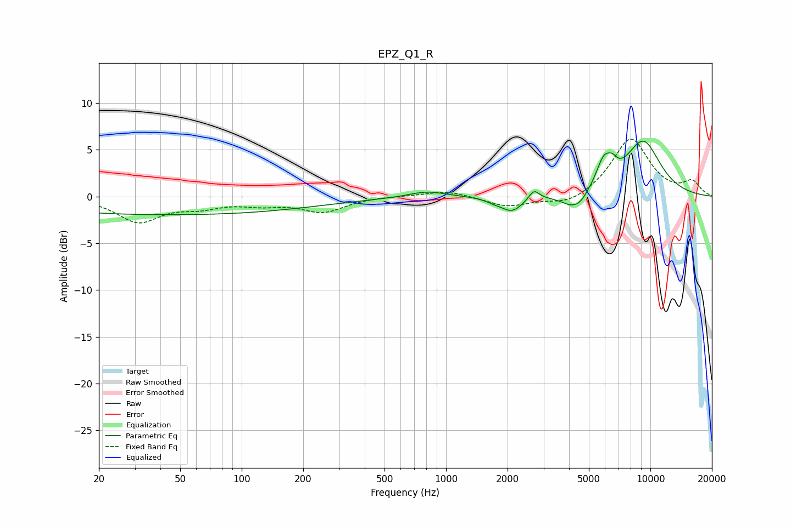

# EPZ_Q1_R
See [usage instructions](https://github.com/jaakkopasanen/AutoEq#usage) for more options and info.

### Parametric EQs
Apply preamp of -6.0 dB when using parametric equalizer.

|   # | Type    |   Fc (Hz) |    Q |   Gain (dB) |
|-----|---------|-----------|------|-------------|
|   1 | Peaking |        44 | 0.18 |        -1.9 |
|   2 | Peaking |       807 | 1.56 |         0.7 |
|   3 | Peaking |      1708 | 3.65 |        -0.3 |
|   4 | Peaking |      2103 | 2.62 |        -1.6 |
|   5 | Peaking |      2694 | 5.62 |         1.1 |
|   6 | Peaking |      4211 | 2.33 |        -1.6 |
|   7 | Peaking |      4574 | 4.51 |        -0.4 |
|   8 | Peaking |      5924 | 3.64 |         2.9 |
|   9 | Peaking |      6529 | 5.99 |         0.9 |
|  10 | Peaking |      9205 | 1.41 |         5.8 |

### Fixed Band EQs
When using fixed band (also called graphic) equalizer, apply preamp of **-6.2 dB** (if available) and set gains manually with these parameters.

|   # | Type    |   Fc (Hz) |    Q |   Gain (dB) |
|-----|---------|-----------|------|-------------|
|   1 | Peaking |        31 | 1.41 |        -2.6 |
|   2 | Peaking |        62 | 1.41 |        -0.9 |
|   3 | Peaking |       125 | 1.41 |        -0.7 |
|   4 | Peaking |       250 | 1.41 |        -1.6 |
|   5 | Peaking |       500 | 1.41 |         0.1 |
|   6 | Peaking |      1000 | 1.41 |         0.7 |
|   7 | Peaking |      2000 | 1.41 |        -1.1 |
|   8 | Peaking |      4000 | 1.41 |        -1   |
|   9 | Peaking |      8000 | 1.41 |         6.2 |
|  10 | Peaking |     16000 | 1.41 |         1.5 |

### Graphs

